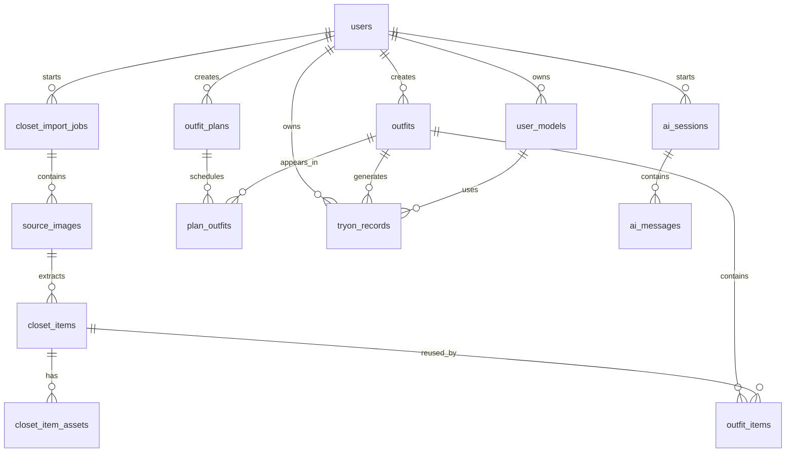

# asis Demo 主数据表设计

本项目 V1 使用本地 JSON manifest 和文件目录实现，字段按未来数据库表设计。后续迁移到 SQLite / Postgres 时，可把 manifest 中的对象一一映射为下列表。

## 表关系总览

## 核心表

### `closet_import_jobs`

一次入柜任务，来源可以是上传、本地拍照、小红书链接或普通网页链接。

| 字段 | 类型 | 说明 |
|---|---|---|
| `import_job_id` | string pk | 入柜任务 ID |
| `user_id` | string fk | V1 固定为 `local_user` |
| `source_type` | enum | `upload` / `xhs_link` / `web_link` / `camera` |
| `source_url` | string nullable | 链接来源 |
| `status` | enum | `processing` / `partial` / `completed` / `failed` |
| `summary` | json | 创建、待确认、失败数量 |
| `created_at` | datetime | 创建时间 |
| `updated_at` | datetime | 更新时间 |

### `source_images`

原图资产，一张原图可以提取出多件衣物。

| 字段 | 类型 | 说明 |
|---|---|---|
| `source_image_id` | string pk | 原图 ID |
| `import_job_id` | string fk | 来源任务 |
| `source_path` | string | `outputs/closet/sources/` 下的本地路径 |
| `source_url` | string nullable | 原始链接 |
| `image_index` | int | 链接页面中的图片序号 |
| `width` / `height` | int | 原图尺寸 |
| `created_at` | datetime | 创建时间 |

### `closet_items`

电子衣橱的最核心表，对应用户看到的单品。

| 字段 | 类型 | 说明 |
|---|---|---|
| `item_id` | string pk | 单品 ID |
| `user_id` | string fk | V1 固定为 `local_user` |
| `source_image_id` | string fk | 来源原图 |
| `category` | enum | `top` / `bottom` / `skirt` / `dress` / `shoes` / `bag` / `accessory` |
| `category_label` | string | 中文类别名 |
| `crop_box` | int[] | 原图裁剪框 |
| `attributes` | json | 颜色、材质、版型、袖长、领型、图案、风格标签 |
| `quality` | json | `usable` / `review` / `rejected`、原因、置信度 |
| `favorite` | bool | 是否收藏 |
| `note` | string | 用户备注 |
| `created_at` | datetime | 创建时间 |
| `updated_at` | datetime | 更新时间 |
| `deleted` | bool | 软删除 |

### `closet_item_assets`

单品资产表，V1 嵌在 `closet_items.assets` 中。

| 字段 | 类型 | 说明 |
|---|---|---|
| `asset_id` | string pk | 资产 ID |
| `item_id` | string fk | 单品 ID |
| `asset_type` | enum | `cutout` / `mask` / `preview` |
| `path` | string | `/closet-outputs/...` 公开路径 |
| `width` / `height` | int | 资产尺寸 |
| `created_at` | datetime | 创建时间 |

### `outfits`

套装表，承载首页灵感卡和衣橱“套装”模式。

| 字段 | 类型 | 说明 |
|---|---|---|
| `outfit_id` | string pk | 套装 ID |
| `user_id` | string fk | V1 固定为 `local_user` |
| `title` | string | 套装名 |
| `cover_path` | string | 套装封面图 |
| `scene_tags` | string[] | 场景标签，如通勤、旅行、约会 |
| `favorite_count` | int | 展示用收藏数 |
| `created_at` | datetime | 创建时间 |
| `updated_at` | datetime | 更新时间 |
| `deleted` | bool | 软删除 |

### `outfit_items`

套装和单品的多对多关系。

| 字段 | 类型 | 说明 |
|---|---|---|
| `outfit_id` | string fk | 套装 ID |
| `item_id` | string fk | 单品 ID |
| `slot` | enum | `top` / `bottom` / `dress` / `shoes` / `bag` / `accessory` |
| `sort_order` | int | 封面和搭配顺序 |

### `outfit_plans`

行程 / 计划表，V1 先预留入口。

| 字段 | 类型 | 说明 |
|---|---|---|
| `plan_id` | string pk | 行程 ID |
| `user_id` | string fk | V1 固定为 `local_user` |
| `title` | string | 行程名 |
| `scene` | string | 旅行、面试、婚礼等 |
| `date_range` | json | 开始和结束日期 |
| `created_at` | datetime | 创建时间 |
| `updated_at` | datetime | 更新时间 |

### `tryon_records`

试穿记录表，支撑“我”页面的试穿记录和后续分享。

| 字段 | 类型 | 说明 |
|---|---|---|
| `record_id` | string pk | 试穿记录 ID |
| `user_id` | string fk | V1 固定为 `local_user` |
| `mode` | enum | `from_item` / `from_outfit` / `mock_from_outfit` |
| `status` | enum | `generated` / `failed` / `pending` |
| `outfit_id` | string nullable | 来源套装 |
| `item_id` | string nullable | 来源单品 |
| `model_id` | string nullable | 试穿模特 |
| `image_path` | string | 结果图 |
| `scene_tags` | string[] | 场景标签 |
| `note` | string | 结果说明 |
| `created_at` | datetime | 创建时间 |
| `updated_at` | datetime | 更新时间 |
| `deleted` | bool | 软删除 |

## 当前本地落盘映射

| 逻辑表 | 当前文件 |
|---|---|
| `source_images` / `closet_items` / `closet_item_assets` | `outputs/closet/closet_manifest.json` |
| `outfits` / `outfit_items` / `outfit_plans` | `outputs/closet/outfits_manifest.json` |
| `tryon_records` | `outputs/closet/tryon_records_manifest.json` |
| 原图 | `outputs/closet/sources/` |
| 单品图 | `outputs/closet/items/` |
| 套装封面 | `outputs/closet/outfits/` |
| 试穿结果 | `outputs/closet/tryon_records/` |

## V1 查询主路径

1. 首页灵感试穿：`outfits` -> `outfit_items` -> `closet_items` -> `closet_item_assets`
2. 衣橱单品：`closet_items` 按 `category` 过滤
3. 单品去搭配：选择多个 `closet_items`，写入 `outfits` 和 `outfit_items`
4. 套装试穿：读取 `outfits`，生成 `tryon_records`
5. 我的页面：按时间倒序读取 `tryon_records`

