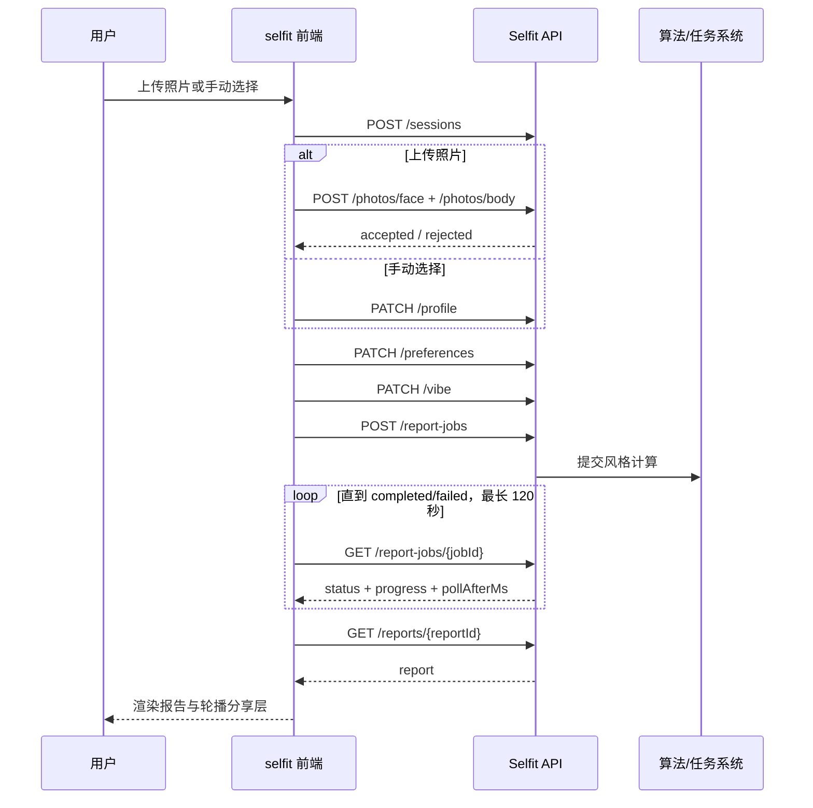

# selfit onboarding 前后端对接协议

版本：`selfit-onboarding-v1`  
前端入口：`/selfit`  
API 基路径：`/api/v1/selfit`

本文是 onboarding 从照片/手动信息到风格报告、穿搭请求和分享素材的后端实现依据。报告内容字段另见 [`SELFIT_REPORT_DATA_CONTRACT.md`](./SELFIT_REPORT_DATA_CONTRACT.md)。

## 1. 职责边界

| 环节 | 前端负责 | 后端负责（可信结果） | 接口 |
|---|---|---|---|
| 会话 | 保存不透明的 `sessionId` 和过期时间、恢复流程 | 会话生命周期、步骤数据、版本号 | `POST/GET /sessions` |
| 照片 | MIME、12MB 上限预检与本地预览 | 光线、清晰度、构图、单人/全身等质量判断，保存资产 | `POST /sessions/{id}/photos/{kind}` |
| 手动信息 | 单选交互、完整性检查 | 枚举校验和标准化 | `PATCH /sessions/{id}/profile` |
| 偏好 | 滑杆、色板选择 | 保存轴值并供算法解释 | `PATCH /sessions/{id}/preferences` |
| 表达问卷 | 每题单选、完整性检查 | 保存答案并供风格计算 | `PATCH /sessions/{id}/vibe` |
| 报告计算 | 展示四段 Figma 进度、轮询 | 画像合并、风格计算、内容/图片推荐、任务状态 | `POST /report-jobs`、`GET /report-jobs/{id}` |
| 报告展示 | 按契约渲染、响应式布局 | 返回最终报告，图片 URL 可替换 | `GET /reports/{id}` |
| 帮我搭一套 | 发起意图、反馈排队状态 | 建立穿搭请求及后续生命周期 | `POST /reports/{id}/outfit-requests` |
| 保存并分享 | 轮播选择、渠道选择、下载/唤起 | 合成分享图片、返回可访问资源 | `POST /reports/{id}/share-assets` |

原则：前端不读取原始模型分数、mask、provider、pipeline 或内部标签。后端可复用现有 `/analyze` 能力，但必须转换成本文的稳定业务响应。

## 2. 运行模式

页面默认使用 Mock，便于无后端时完整演示；联调环境切到 `live`：

```html
<script>
window.__SELFIT_CONFIG__ = {
  apiMode: 'live',
  apiBase: '/api/v1/selfit',
  timeoutMs: 15000
};
</script>
```

也可临时使用 `/selfit?apiMode=live`。正式环境应由服务端注入配置，不依赖查询参数。

## 3. 通用约定

- JSON 使用 UTF-8、`camelCase`；时间使用 ISO 8601 UTC。
- 认证沿用同源安全 Cookie；跨域部署时必须配置明确的 CORS 与凭据策略。
- 创建、上传、修改、生成类请求携带 `X-Idempotency-Key`。同一用户和 key 必须返回同一业务结果。
- 每个成功响应建议带 `requestId`；错误必须使用统一结构。
- 会话写操作返回递增 `revision`。若后端支持乐观锁，可增加 `If-Match: {revision}`，冲突返回 `409 session.revision_conflict`。
- 图片 URL 应为 HTTPS 完整地址或同源根路径；临时签名 URL 的有效期不得短于页面正常浏览时长。
- 除照片上传外请求超时 15 秒；照片上传 45 秒；报告任务由轮询控制，总等待上限 120 秒。
- `429`、`502`、`503`、`504` 可标记 `retryable: true`；校验错误不可自动重试。

统一错误：

```json
{
  "requestId": "req_01H...",
  "error": {
    "code": "photo.insufficient_light",
    "message": "照片光线不充足，请换到明亮环境重拍。",
    "retryable": false,
    "details": { "kind": "face", "issues": ["insufficient_light"] }
  }
}
```

## 4. 接口定义

### 4.1 创建与恢复会话

`POST /sessions`

```json
{ "schemaVersion": "selfit-onboarding-v1", "locale": "zh-CN" }
```

`201`：

```json
{
  "requestId": "req_01",
  "session": {
    "sessionId": "ses_01",
    "status": "draft",
    "revision": 1,
    "expiresAt": "2026-08-22T10:00:00Z"
  }
}
```

`GET /sessions/{sessionId}` 返回同样的 `session` 包装；已过期返回 `404 session.expired`。响应可以补充 `completedSteps`，但前端不依赖该字段。

### 4.2 上传并检测照片

`POST /sessions/{sessionId}/photos/{kind}`，其中 `kind = face | body`。请求为 `multipart/form-data`，文件字段固定为 `image`；支持 JPEG、PNG、WebP，最大 12MB。

`200` 可用：

```json
{
  "requestId": "req_02",
  "revision": 2,
  "photo": {
    "kind": "face",
    "assetId": "asset_face_01",
    "status": "accepted",
    "code": "photo.accepted",
    "message": "面部照可用",
    "issues": []
  }
}
```

业务不可用仍返回 `200`，便于用户原位重传：

```json
{
  "revision": 2,
  "photo": {
    "kind": "body",
    "assetId": null,
    "status": "rejected",
    "code": "photo.insufficient_light",
    "message": "全身照光线不充足",
    "issues": ["insufficient_light"]
  }
}
```

建议问题枚举：`insufficient_light`、`blurred`、`face_not_found`、`multiple_people`、`body_not_complete`、`unsupported_content`。协议/大小错误使用 `400/413/415`。

### 4.3 保存手动 suit 信息

`PATCH /sessions/{sessionId}/profile`

```json
{
  "manual": {
    "skin": "自然白",
    "faceShape": "椭圆脸",
    "bodyShape": "梨型"
  }
}
```

枚举应以产品配置为准；当前 Figma 值为：

- `skin`：白皙色、自然白、自然色、健康色、小麦色（6 档合 5 档：蜜糖色并入小麦色，自然色居中、左右各两档）
- `faceShape`：椭圆脸、圆脸、方脸、心形脸、菱形脸（长脸并入椭圆脸，算法侧以「偏修长」子标签保留长宽比信息）
- `bodyShape`：梨型、倒三角型、沙漏型、矩型、苹果型

`200`：

```json
{ "requestId": "req_03", "session": { "sessionId": "ses_01", "status": "draft", "revision": 3 } }
```

照片 route 与手动 route 可以任选其一。后端报告算法必须明确优先级，建议“有效照片推断 + 用户手动纠正优先”。

### 4.4 保存 like 偏好

`PATCH /sessions/{sessionId}/preferences`

```json
{
  "axes": { "shape": 42, "energy": 64, "trend": 42 },
  "palette": "mono"
}
```

轴值为 `0..100`：`shape` 从硬朗锐利到柔和温柔，`energy` 从简约克制到精致繁复，`trend` 从经典耐看到时髦先锋。色板枚举：`mono | earth | ocean | jewel | bright | pastel`。响应同 4.3。

### 4.5 保存 vibe 问卷

`PATCH /sessions/{sessionId}/vibe`

```json
{
  "answers": { "occasion": "A", "wardrobe": "B", "expression": "A" }
}
```

当前题目 key 为 `occasion`、`wardrobe`、`expression`，值为选项 `A..E`。题目文案可在未来由配置接口下发，但报告计算必须按稳定的题目/选项 ID，而不是展示文案。响应同 4.3。

### 4.6 创建并轮询报告任务

`POST /sessions/{sessionId}/report-jobs`，body `{}`。

`202`：

```json
{
  "requestId": "req_06",
  "job": { "jobId": "job_01", "status": "queued", "progress": 0, "pollAfterMs": 800 }
}
```

`GET /report-jobs/{jobId}`：

```json
{
  "job": {
    "jobId": "job_01",
    "status": "processing",
    "progress": 50,
    "stage": "inspiration",
    "pollAfterMs": 800
  }
}
```

状态：`queued | processing | completed | failed`。`progress` 为 `0..100`，建议阶段：`profile`、`inspiration`、`composition`、`finalizing`。前端把连续进度映射到 25/50/75/100 四个设计帧，不要求后端精确返回四个离散值。

完成时：

```json
{
  "job": {
    "jobId": "job_01",
    "status": "completed",
    "progress": 100,
    "stage": "finalizing",
    "reportId": "rep_01"
  }
}
```

后端也可附带 `report`，前端会直接渲染以减少一次请求。失败时 `job.error` 使用统一错误字段 `{code,message,retryable,details}`。

### 4.7 获取报告

`GET /reports/{reportId}`

```json
{ "requestId": "req_07", "report": { "eyebrow": "SOFT COOL", "title": "中性利落派" } }
```

`report` 的完整字段、数组替换规则和图片约束见报告数据契约。生产后端应返回完整报告；前端默认值仅用于 Mock/设计验收，不应掩盖生产数据缺失。

### 4.8 帮我搭一套

`POST /reports/{reportId}/outfit-requests`

```json
{ "source": "report", "intent": "complete_look" }
```

`202`：

```json
{ "requestId": "req_08", "request": { "requestId": "outfit_01", "status": "queued" } }
```

若后续需要实时结果，建议新增 `GET /outfit-requests/{id}`，沿用报告任务的状态模型。

### 4.9 生成分享素材

`POST /reports/{reportId}/share-assets`

```json
{ "slideIndex": 0, "channel": "保存单张", "format": "png" }
```

`channel` 当前展示值：`保存单张 | 发笔记 | 微信好友 | 朋友圈`。服务端可将其映射为稳定枚举，但在迁移期需兼容这些值。

`200/202`：

```json
{
  "requestId": "req_09",
  "asset": {
    "assetId": "share_01",
    "status": "ready",
    "slideIndex": 0,
    "channel": "保存单张",
    "downloadUrl": "https://cdn.example.com/selfit/share_01.png",
    "expiresAt": "2026-08-21T12:00:00Z"
  }
}
```

若合成需要异步处理，返回 `status: processing` 并同时提供可轮询的 `jobId`；此扩展需在联调前确认。

## 5. 主流程时序



## 6. 隐私与安全

- 浏览器不把图片、base64、推断属性或报告写入 `localStorage`；当前仅保存 `sessionId/expiresAt`。
- 服务器应提供会话与原图 TTL、用户删除机制和审计策略；过期后统一返回 `session.expired`。
- 日志不得记录原图、签名 URL、完整画像和问卷答案；只记录 request/job/session 的脱敏 ID。
- 上传端做 MIME、魔数、尺寸、解码和内容安全检查，不能信任文件扩展名。
- 分享 URL 使用短时签名并限制可执行内容；SVG 等主动内容不作为用户上传图片直接回显。

## 7. 错误码与前端行为

| code | HTTP | 前端行为 |
|---|---:|---|
| `session.expired` | 404 | 清除本地会话，下次提交新建会话 |
| `session.revision_conflict` | 409 | 拉取会话后提示用户重试 |
| `photo.*` 业务问题 | 200 | 上传卡片原位展示并允许重传 |
| `validation.invalid_enum` | 422 | 保留当前页面并提示修正 |
| `report.job_not_found` | 404 | 返回问卷页，允许重新生成 |
| `report.generation_failed` | 200 job failed | 返回问卷页并展示可行动文案 |
| `rate_limited` | 429 | 使用 `Retry-After`，避免连续点击 |
| `network.timeout` / 5xx | 504/5xx | 保留用户已选内容，允许重试 |

## 8. 联调验收清单

- [ ] Mock 与 live 使用同一套页面组件，切换模式无需改业务代码。
- [ ] 重复提交同一幂等 key 不创建重复报告、穿搭请求或分享图。
- [ ] 两类照片的接受/拒绝状态和问题文案正确；被拒照片不产生可用 `assetId`。
- [ ] 手动 route 不要求上传照片；上传 route 必须两张均 accepted 才能继续。
- [ ] 轴值、色板、三道问卷全部写入同一个 session，revision 单调增加。
- [ ] 报告任务支持 queued、processing、completed、failed，并遵守 `pollAfterMs`。
- [ ] 报告图片无 404，返回字段能完整替换 Figma 默认内容。
- [ ] 分享第 1/2/3 张分别把 `slideIndex` 0/1/2 传给后端。
- [ ] 会话过期、弱网、超时和 5xx 时页面不丢失当前已选内容。
- [ ] 390–430px 无横向溢出，问卷底部选项不被 CTA 遮挡，报告按钮按滚动规则出现。
