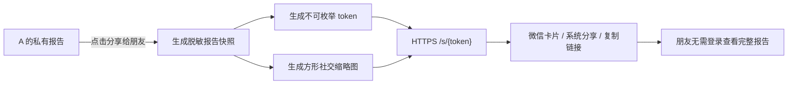

# selfit 报告链接分享可行性与技术方案

> 调研日期：2026-08-29  
> 范围：朋友通过分享链接查看完整报告，以及微信会话内的标题、摘要和缩略图。本文不包含业务代码实现。

## 1. 结论

功能可行，且不需要改动人格算法或报告数据契约。需要增加的是一层独立的“可公开访问的报告快照”，以及一个能在服务端输出动态元信息的分享页。

根据当前资质情况，本期范围收敛为 P0，P1 待具备已认证服务号后再启动：

1. **P0：报告公开链接**，解决“朋友点开看不到报告”和“链接没有报告缩略图”。这层不依赖微信 JS-SDK，所有浏览器都能使用。
2. **P1（本期不做）：微信内定制分享**，使用公众号 JS-SDK 稳定设置“发送给朋友/朋友圈”的标题、描述、链接和图片。当前缺少已认证服务号，暂不纳入交付范围。

本期只交付 P0。P0 本身就能完成“发链接给朋友，对方看完整报告”的核心目标，并通过服务端元信息为普通社交抓取提供标题、摘要和缩略图。

## 2. 现状证据与问题定位

### 2.1 现在的“分享”实际上是保存图片

- 分享弹层有 3 张可滑动的报告卡，但当前只渲染了“保存到相册”一个操作：`app/static/selfit/index.html:102-127`。
- 微信内会生成图片并引导长按保存；非微信浏览器优先通过 Web Share API 分享“图片文件”，而不是可查看报告的 URL：`app/static/selfit/selfit.js:1122-1146`。
- 后端已有 `POST /reports/{reportId}/share-assets`，但返回的是图片 `downloadUrl`，不是报告页链接：`app/selfit_onboarding.py:1411-1471`。
- 分享卡中的二维码是静态图 `share-report-qr.png`，不会随报告生成专属链接：`app/static/selfit/index.html:110,113,116`。

因此，用户如果通过微信页面右上角分享，实际分享的是通用 `/selfit` 入口，不是这份报告。

### 2.2 朋友在新设备上无权读取原报告

- `GET /api/v1/selfit/reports/{reportId}` 会检查记录的 `user_id`；登录用户报告只对同一用户可见：`app/selfit_onboarding.py:195-199, 1293-1307`。
- 报告与 onboarding session 绑定；当前 session 默认 24 小时过期，清理时会同时移除报告和分享素材索引：`app/selfit_onboarding.py:91-92, 159-185`。
- 所以不能简单新增 `/selfit?reportId=...`：陌生设备没有拥有者凭证，并且报告会随 session 很快失效。

### 2.3 截图中的卡片为通用页卡片

- `/selfit` 输出的 `<title>` 固定为“selfit · 先认识自己，再决定怎么穿”，与截图文字一致。
- 当前 `<head>` 没有报告维度的 `og:title / og:description / og:image / og:url`：`app/static/selfit/index.html:3`。
- 页面只有 `/selfit` 固定路由，服务端不知道要为哪份报告输出标题和封面：`app/main.py:727-736`。

截图右侧是缺失图占位，与“通用入口没有一张可被微信公开抓取的报告封面”相符。

## 3. 产品和权限语义

不要把“报告所有者接口”改为无鉴权公开。推荐保留现有私有报告，用户点击“分享给朋友”时显式发布一份可撤销快照：

- **默认不公开**：报告仍只对本人可见。
- **持链接可见**：用户主动创建分享后，拥有高强度随机 token 的人可读取脱敏报告快照。
- **快照稳定**：用户之后重测不改变已分享的结果；新结果需创建新分享。
- **可过期、可撤销**：MVP 默认有效 **7 天**，页面告知“链接 7 天内有效，拿到链接的人可查看”；本人可提前停止分享。
- **不可搜索**：分享页设置 `noindex,nofollow,noarchive`，不提供分享列表或可枚举 ID。

## 4. 推荐架构



### 4.1 新增数据实体 `public_report_shares`

建议存报告脱敏快照，而不是只存 `report_id` 引用，以解耦当前 24 小时 session TTL：

```json
{
  "share_id": "shr_internal_id",
  "token_hash": "sha256(raw_token)",
  "report_id": "rep_owner_only",
  "owner_user_id": "u_owner_only",
  "snapshot_version": 1,
  "report_snapshot": {},
  "title": "我的 selfit 风格报告 · 静音时髦",
  "description": "低表达 · 低装饰 · 秩序感",
  "cover_asset_key": "public-shares/shr_x/cover.jpg",
  "status": "active",
  "expires_at": "2026-09-05T00:00:00Z",
  "created_at": "2026-08-29T00:00:00Z",
  "revoked_at": null
}
```

实现约束：

- token 使用至少 128 bit CSPRNG 随机数，URL 中仅出现原始 token，服务端只存哈希。
- `report_snapshot` 必须通过明确白名单生成，只保留报告展示所需的 `typeId`、标题、特质、色卡、妆发/穿搭建议和对应公开素材 URL。
- 严禁进入快照：手机号、`user_id`、`session_id`、人脸/全身原图、原始问卷答案、算法调试字段、签名私有素材 URL。
- 公开分享记录的清理周期与 onboarding session 分开；过期或撤销后页面返回友好的“这份报告已停止分享”，不回退到他人登录页。

MVP 内测可延续 SQLite 文档存储，但需在 `COLLECTIONS` 中单独增加集合；正式规模化前应迁移到具备行级事务和索引的数据库。

### 4.2 建议 API

#### 拥有者创建分享

```http
POST /api/v1/selfit/reports/{reportId}/public-shares
Authorization: Bearer <owner-token>
Content-Type: application/json

{
  "slideIndex": 0,
  "expiresInDays": 7
}
```

```json
{
  "share": {
    "shareId": "shr_x",
    "url": "https://example.com/s/<opaque-token>",
    "thumbnailUrl": "https://example.com/s/<opaque-token>/cover.jpg",
    "expiresAt": "2026-09-05T00:00:00Z"
  }
}
```

对同一 `reportId + slideIndex + owner + active` 应幂等复用现有链接，除非用户选择“重新生成链接”。

#### 公开页与数据

```http
GET /s/{token}                              # 服务端渲染 HTML + 动态 meta
GET /api/v1/selfit/public-shares/{token}    # 只返回脱敏 snapshot
GET /s/{token}/cover.jpg                    # 无 Cookie/无登录可访问
```

#### 拥有者停止分享

```http
DELETE /api/v1/selfit/public-shares/{shareId}
Authorization: Bearer <owner-token>
```

### 4.3 分享页服务端元信息

微信抓取或其他社交平台抓取页面时不能假设它会执行前端 JavaScript。`GET /s/{token}` 必须直接在首个 HTML 响应中输出：

```html
<title>Ta的 selfit 风格报告 · 静音时髦</title>
<meta name="description" content="低表达 · 低装饰 · 秩序感">
<meta property="og:type" content="website">
<meta property="og:title" content="Ta的 selfit 风格报告 · 静音时髦">
<meta property="og:description" content="低表达 · 低装饰 · 秩序感">
<meta property="og:image" content="https://example.com/s/<token>/cover.jpg">
<meta property="og:url" content="https://example.com/s/<token>">
<meta name="robots" content="noindex,nofollow,noarchive">
```

注意：

- `og:image` 和 `og:url` 使用基于 `SELFIT_PUBLIC_BASE_URL` 的绝对 HTTPS URL，不能是 `/static/...` 相对路径。
- 封面推荐另外生成方形 JPG/PNG（建议先用 `600×600`，再用真机调整），而不是直接拿现有 `1080×1440` 长图当小图，避免被卡片裁切。
- 封面端点不要依赖 Authorization/Cookie，应直接返回 `200` 和正确 `Content-Type`；可使用长缓存，但 URL 应随 token 不可变。
- 微信可能缓存分享卡片。修改封面时生成新链接/新 token，不尝试用原 URL 强刷历史卡片。

### 4.4 微信内分享增强（P1，本期暂缓）

微信公众号 JS-SDK 支持为“发给朋友”和“朋友圈”设置 `title / desc / link / imgUrl`。完整接入包括：

1. 在公众平台配置 JS 接口安全域名。
2. 服务端用 AppID/AppSecret 获取并缓存 `access_token` 和 `jsapi_ticket`，不得将 AppSecret 下发到浏览器。
3. 增加签名接口，按当前页面 URL（不含 `#` 之后部分）返回 `appId / timestamp / nonceStr / signature`。
4. 前端引入官方 JSSDK，在 `wx.ready` 后调用 `wx.updateAppMessageShareData` 和 `wx.updateTimelineShareData`。
5. 微信内的主按钮文案使用“分享给微信好友”，创建链接并完成 JSSDK 配置后，引导用户点右上角发送。H5 页面不应承诺“点一下直接发给某个微信好友”。

参考：[微信 JS-SDK 官方说明](https://developers.weixin.qq.com/doc/offiaccount/OA_Web_Apps/JS-SDK.html)、[微信官方 JS-SDK npm 包说明](https://www.npmjs.com/package/weixin-js-sdk)。

### 4.5 普通浏览器降级策略

- 支持 Web Share API 时：`navigator.share({ title, text, url })`，这里分享的是 URL，不是图片文件。
- 不支持时：显示“复制链接”，通过 Clipboard API 复制。
- 现有“保存到相册”保留，但与“分享可查看报告的链接”分成两个明确动作。
- 小红书等无法直接唤起定向发布的场景，保留“保存图片 + 复制文案/链接”流程。

## 5. 分享落地页

落地页应直接展示朋友的报告，不应先要求接收者登录或重新测试。页面复用现有报告渲染组件和 `SELFIT_REPORT_DATA_CONTRACT`，但切换到只读访客模式：

- 直接展示报告主体，不增加额外的顶部分享提示卡。
- 不显示“返回重测”、所有者的历史记录、原始照片或调试数据。
- 底部可提供“测测我的风格”，跳转新的 `/selfit`。这是新 session，不能复用分享者 session。
- 分享已过期/撤销时，展示独立空状态“好可惜，本分享已过期，请直接扫码访问selfit”和永久有效的 selfit 入口二维码，HTTP 返回 `410 Gone`。
- 为降低 token 经 Referer 外泄，设置 `Referrer-Policy: no-referrer`，页面上的外部链接使用 `rel="noreferrer noopener"`。

### 5.1 好友查看后的体验转化链路

公开报告页同时承担“看好友结果”和“开始自己的测试”两个目标，入口放在报告读完后的自然收尾位置：

1. 报告底部使用好友的实际人格标题承接，例如“Ta是「人间失格」，你会是哪一种？”。
2. 入口跳转 `/selfit?from=shared-report&shared_type={title}`，只传公开的人格标题，不传分享 token、报告 ID 或用户标识。
3. CTA 后以浅灰小字展示明确日期：“本分享将于 x月x日到期”。
4. 测试首页延续同一问题，并将主按钮改为“开始测我的风格”；登录完成后仍保留参数，因此链路不会在登录环节中断。
5. 新测试创建全新的 session。完成后进入自己的报告页，并可再次生成 7 天分享链接，形成“查看 → 测试 → 生成报告 → 再分享”的闭环。

## 6. 动态二维码与缩略图

当前分享卡的静态二维码应替换为服务端生成的当前 `share.url`：

1. 创建公开分享记录。
2. 用对应 `/s/{token}` 生成二维码。
3. 将二维码合成到保存用的三张长卡和社交缩略图中。
4. 用真机在 390-430px 下验证二维码扫描容错；加足够白色 quiet zone，不要被圆角或纹理覆盖。

社交缩略图和用户保存长图是两种产物，可共享渲染输入，但不建议强行共用尺寸。

## 7. 隐私、安全和滥用防护

- 只有报告拥有者能创建或撤销公开链接；复用现有 `_load_visible_report` 的所有权检查。
- 公开 API 按 token 查询，不接受可枚举的 `report_id`，不支持列表/搜索。
- 对创建分享、加载公开报告和缩略图增加限流；日志不记录原始 token，只记录 `share_id` 或 token 哈希前缀。
- 妆发/穿搭素材必须是允许公开展示的本地/CDN 资源，不将内部对象存储签名 URL 长期写入快照。
- 缩略图文本和 URL 需做 HTML 转义；报告富文本继续使用现有受控渲染，不直接注入未清洗 HTML。
- 撤销后浏览数据不应继续暴露报告内容；对已缓存封面接受“无法在所有第三方平台立即撤回”的产品现实，并在用户提示中说明。

## 8. 埋点与成功指标

新增建议事件：

- `share_link_created`：成功生成可访问 URL。
- `share_action_clicked`：微信引导、系统分享、复制链接或保存图片。
- `shared_report_opened`：服务端记录一次有效公开页打开，去除已知爬虫 UA 后用于转化估算。
- `shared_report_try_clicked`：接收者点击顶部或底部“测测我的风格”，记录 `placement` 和公开人格类型。
- `shared_report_try_landed`：接收者到达自己的测试入口，用于区分点击和实际落地。
- `share_revoked / share_expired`：链接终止原因。

不建议把 JSSDK 配置成功或 Web Share Promise resolve 计为“对方已收到”；最可靠的结果指标是 `shared_report_opened`。

## 9. 分阶段实施建议

### P0：可查看报告的链接（建议必做）

1. 数据层增加 `public_report_shares`、token 哈希、脱敏快照、过期和撤销。
2. 增加创建/读取/撤销 API。
3. 增加 `/s/{token}` SSR 落地页和动态 OG meta。
4. 生成方形缩略图和专属二维码。
5. 前端把“保存图片”与“分享报告链接”拆开，增加 Web Share/复制链接降级。
6. 补齐权限、过期、脱敏、meta 和新设备打开测试。

**粗略工期：3-5 人日**（单名熟悉代码的全栈开发，包含自测，不含公众号资质等待）。

### P1：微信卡片稳定定制（已暂缓）

1. 配置公众号 JS 安全域名与正式 HTTPS 域名。
2. 实现 token/ticket 缓存、URL 签名接口和密钥管理。
3. 接入 `updateAppMessageShareData / updateTimelineShareData`。
4. 在 iOS/安卓微信、好友/朋友圈进行真机回归。

**暂不排期**。待已认证服务号与域名配置就绪后，再按 2-3 人日评估实施。

## 10. 验收标准

### 功能

- A 完成测试并创建分享后，B 在无登录、无 A Cookie 的新设备上可直接看到同一份完整报告。
- B 不能看到 A 的手机号、原照、原始答案、用户/session/report 内部 ID。
- A 重测后旧链接仍显示原快照；A 撤销后旧链接不再返回报告。
- 链接过期后给出友好说明，不跳到 A 的登录态。

### 分享卡片

- 用无 Cookie 请求 `GET /s/{token}`，HTML 首响应含本报告的 title/description/absolute image URL。
- 用无 Cookie 请求 `thumbnailUrl`，直接返回 `200 image/jpeg|image/png`，无 302 到需要权限的地址，无 404。
- 微信好友卡片显示人格名称和封面；朋友圈分享不回退成通用 `/selfit` 首页。
- 缩略图不被裁掉人格标题，在浅色/深色微信会话背景都可辨识。

### 页面质量

- 390-430px 无横向溢出、无文字重叠或按钮裁切；桌面端保持居中移动壳。
- 公开报告页资源无 404，控制台无未处理错误。
- 按 `DESIGN.md` MVP Self-Test Checklist 执行页面验收。

## 11. 上线前依赖清单

- 一个外网可访问的正式 HTTPS origin，正确配置 `SELFIT_PUBLIC_BASE_URL`。
- 缩略图存储位置对微信服务器可访问；不可仅在内网、localhost 或需登录的对象存储地址。
- 确认妆发/穿搭内容图片可用于公开分享页。
- P1 依赖项（本期不阻塞 P0）：已认证服务号、AppID/AppSecret、JS 接口安全域名配置权限。

## 12. 最终建议

不建议在现有 `share-assets` 上继续叠加“微信好友”虚拟渠道枚举。应把能力拆成两件事：

1. **可保存的视觉卡片**：现有能力继续完善。
2. **可访问的报告链接**：新增独立的 public share 资源、脱敏快照、SSR 元信息和动态二维码。

这个拆分能同时解决用户反馈的两个问题，也不会破坏现有报告所有权、session 续期和照片隐私边界。
