# AS IS Closet Demo — 技术架构与主流程现状

> 本文档是对当前 demo 代码库的技术现状快照（截至 2026-08），用于补齐"先跑 demo、后补方案"所缺的技术架构说明。
> 内容全部来源于对 `app/`、`asis-agent-runtime/`、`scripts/` 现有代码的梳理，描述的是**现状（as-is）**，不是目标架构（to-be）。
> 每条主流程附一张 PlantUML（UML）图和一张 Mermaid 图，二者表达同一内容，便于在不同工具链中渲染。

---

## 0. 系统一句话概括

一个**单进程 FastAPI 应用**（`app.main:app`，默认 `:8002`）承载全部 HTTP 能力，本地文件系统（`outputs/`）承担全部持久化，按需外挂两类 sidecar：

- **OpenClaw bridge**（Node.js，`:18789`）— AI 穿搭师的 agent runtime 桥接层；
- **小红书 MCP sidecar**（Go，`:18060`）— 小红书搜索/笔记详情的只读数据源。

外部 AI 能力（VLM 衣服理解、图像编辑试穿、LLM 对话）全部走 **provider 抽象 + 本地 fallback** 的验证期架构：有 key/代理就用真实模型，没有就用本地 CV 或 mock provider 固化链路。

---

## 1. 主流程清单

| # | 主流程 | 入口端点 | 核心模块 | 用户价值 |
|---|--------|----------|----------|----------|
| F1 | 色彩测试分析 | `POST /analyze` | `analyzer.py` + `cv_pipeline.py` | 上传自拍 → 四季/十二季/二十四季色彩诊断 |
| F2 | 上衣虚拟试穿 | `POST /try-on` 系列 | `tryon.py` | 人像 + 上衣图 → AI 生成试穿结果图 |
| F3 | 小红书链接提取 | `POST /try-on/extract-xhs` | `tryon.py` | 粘贴笔记链接 → 自动提取可试穿上衣 |
| F4 | 衣橱导入与管理 | `POST /closet/import/*`、`/closet/items|outfits` | `closet.py` | 上传/链接导入 → 自动分割多品类单品入柜 |
| F5 | AI 穿搭师对话 | `POST /stylist/chat` | `stylist.py` + OpenClaw bridge + XHS MCP | 结合衣橱与小红书趋势的对话式穿搭推荐 |
| F6 | 认证与多用户隔离 | `POST /auth/phone/*` | `auth.py` + `storage.py` | 手机号验证码登录，数据按用户隔离 |

横向支撑：`ops.py`（限流/体积限制中间件、部署模式）、`storage.py`（ContextVar 用户存储上下文）、`scripts/check_runtime_readiness.py`（运行时自检）。

---

## 2. 系统总览图（所有主流程串联）

### 2.1 总览 Mermaid 图

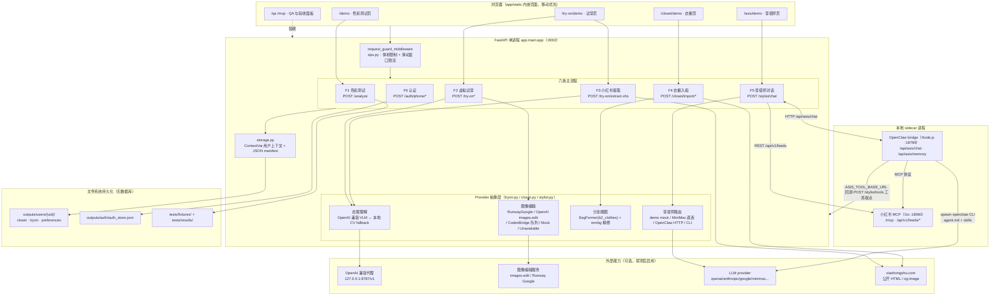

### 2.2 总览 PlantUML 图

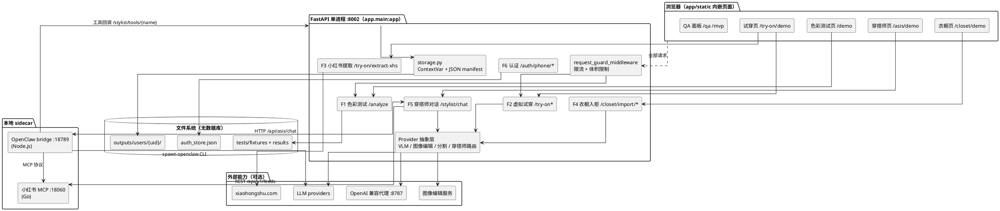

### 2.3 总览说明

1. **单进程 + 文件系统**是当前架构的最大特征：没有数据库、没有消息队列、没有独立 worker；所有用户数据（衣橱、试穿、会话、认证）都落在 `outputs/` 目录的 JSON manifest + 图片文件中。
2. **六条主流程共享同一套基础设施**：`ops.py` 的限流中间件拦在所有请求之前；`auth.py` 颁发的 Bearer Token 解出 `user_id` 后，由 `storage.py` 的 `ContextVar` 在整个请求周期内决定数据读写目录。
3. **流程之间通过数据串联而非直接调用**：F4 入柜的单品是 F2/F5 的输入（试穿用 garment、穿搭师上下文）；F3 提取的上衣既可进 F2 试穿，也可进 F4 入柜；F1 的色彩结论是 F5 穿搭建议的推理依据之一（`color-match` skill）。
4. **外部 AI 能力全部可插拔**：provider 探测失败时自动降级（本地 CV / mock / demo 回复），保证 demo 在零外部依赖下也能跑通全链路——这是"验证期"架构的核心设计。
5. **穿搭师是唯一多进程流程**：FastAPI → OpenClaw bridge（HTTP）→ openclaw CLI（子进程）→ LLM；agent 再反向回调 FastAPI 的 `/stylist/tools/{name}` 读取衣橱/发起试穿，并可经 MCP 协议使用小红书 sidecar。

---

## 3. F1 色彩测试分析流程（`POST /analyze`）

### 3.1 UML 活动图（PlantUML）

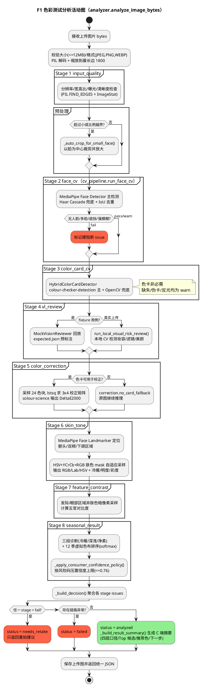

### 3.2 Mermaid 流程图

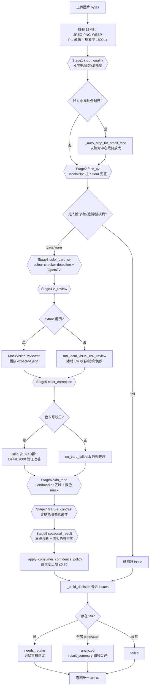

### 3.3 流程说明

- **编排入口**：`app/analyzer.py: analyze_image_bytes()`，8 个 stage 顺序执行，每个 stage 输出统一结构 `{status: pass|warn|fail|unknown, confidence, evidence, issues, suggestions}`。
- **双链路设计**：fixture 链路（`GET /fixtures/{case_id}/analyze`）回放 `tests/fixtures/expected.json` 中的 Codex 辅助标注保证回归稳定（当前 53/53 通过）；真实上传链路（`POST /analyze`）的 `vl_review` 改走本地 CV 初筛（口红/腮红/偏色/磨皮），未来生产化时替换 `OpenAIVisionReviewer`。
- **硬阻断 vs 软风险**：分辨率过低、严重过曝、非人像、多人脸、严重遮挡等判 `fail` → 整体 `needs_retake`；无色卡、轻微美颜、自动裁剪等判 `warn` → 仍可 `analyzed`，但进入 `_build_result_summary()` 的四层口径分流：`standard` / `light_note` / `low_confidence` / `retake`。
- **置信度上限保护**：验证期规则推理不允许包装成"高置信绝对判断"，`seasonal_result` 的置信度按命中的风险码取上限最小值（验证期全局 ≤0.76，浓妆/滤镜 ≤0.62，无色卡 ≤0.70）。
- **本地模型**：`app/models/` 下只有两个 MediaPipe 模型文件（人脸检测 + 478 点 Landmarker），首次调用时懒加载，无 GPU 依赖。
- **降级主线**：色卡检测失败 → 不用色卡；校正矩阵求解失败 → 原图推理；Landmarker 失败 → 人脸框比例区域。整条链路的设计原则是"能出结果就不阻断，但必须在 `decision.warnings` 和 `capture.risk_labels` 里如实标记"。

---

## 4. F2 上衣虚拟试穿流程（`POST /try-on` 系列）

### 4.1 UML 活动图（PlantUML）

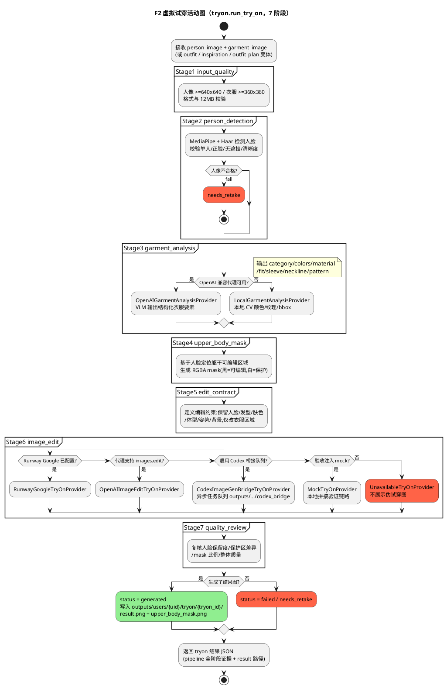

### 4.2 Mermaid 流程图

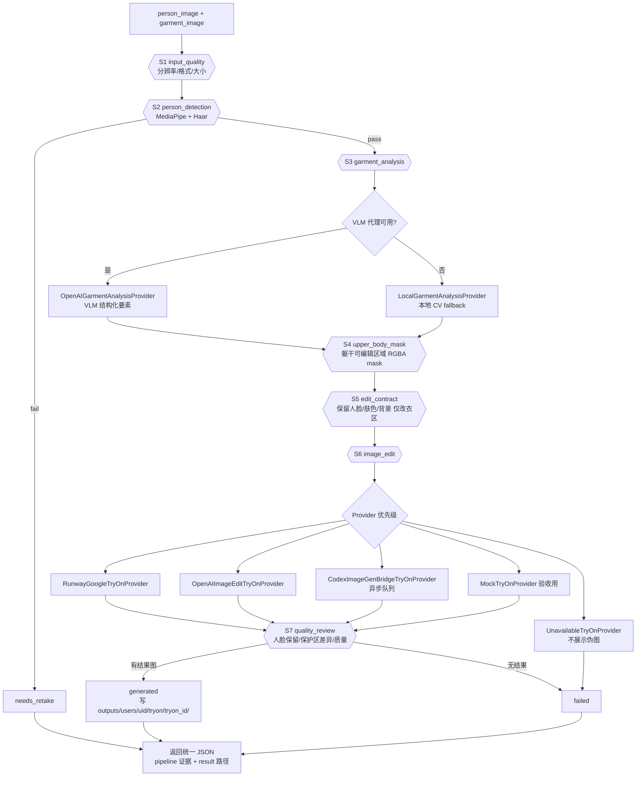

### 4.3 流程说明

- **编排入口**：`app/tryon.py: run_try_on()`，7 个 stage 定义在 `TRYON_PIPELINE_STAGES`。HTTP 层有 5 个变体入口（`/try-on`、`/from-inspiration`、`/from-outfit`、`/from-outfit-plan`、`/asis/try-on/from-outfit`），最终都汇入同一 pipeline，差别只在 garment 素材的来源（直接上传 / 灵感图 / 衣橱搭配）。
- **双层 provider 抽象**：
  - 衣服理解层 `_default_garment_analysis_provider()`：探测 `TRYON_OPENAI_BASE_URL` / 本地 `127.0.0.1:8787/v1` 代理，可用则走 VLM，否则本地 CV。返回结构中的 `pipeline.garment_analysis.evidence.provider` 会如实标记当前 provider。
  - 图像编辑层 `_default_provider()`：按 RunwayGoogle → OpenAI images.edit → CodexBridge（异步任务队列，供外部 agent 取任务回传结果）→ Mock → Unavailable 优先级选择。
- **诚实降级原则**：没有真实图像编辑能力时，用户接口**不展示伪试穿图**（`UnavailableTryOnProvider`），mock 只在验收脚本 `scripts/tryon_mvp_acceptance.py` 中显式注入，用于固化 mask、接口和页面链路。
- **能力自描述**：`GET /try-on/capabilities` 返回当前代理地址、衣服理解是否走 VLM、真实图片编辑是否可用，前端据此决定 UI 展示口径。
- **产出落盘**：每次试穿一个工作目录 `outputs/users/{uid}/tryon/{tryon_id}/`，含 `result.png`、`upper_body_mask.png` 等；AS IS 模式下还会写入试穿记录 manifest（见 F4）。

---

## 5. F3 小红书链接提取流程（`POST /try-on/extract-xhs`）

### 5.1 UML 时序图（PlantUML）

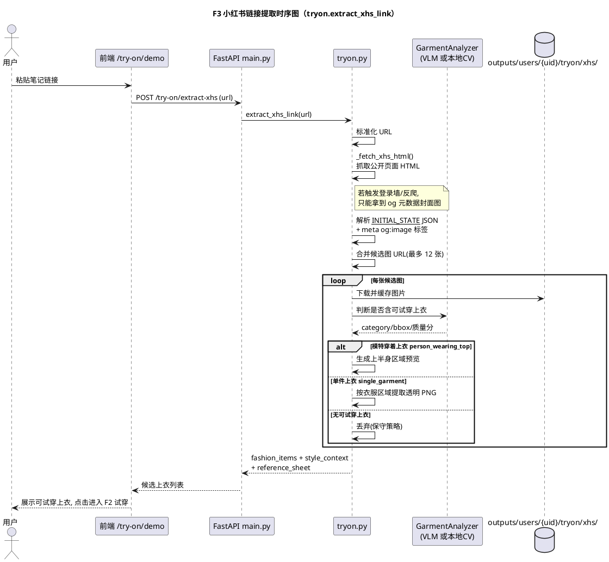

### 5.2 Mermaid 流程图

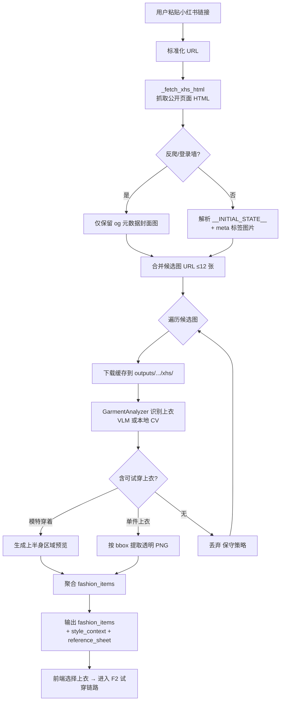

### 5.3 流程说明

- **职责**：把"刷到喜欢的穿搭"转化为"可试穿的素材"，是内容平台到试穿链路的桥。
- **抓取策略**：纯服务端 httpx 抓公开 HTML，解析 `__INITIAL_STATE__` 内嵌 JSON 与 `og:image` 元数据，最多取 12 张候选图下载缓存到 `outputs/users/{uid}/tryon/xhs/`。
- **识别策略偏保守**：复用 F2 的 `GarmentAnalyzer` 判断每张图是否有可试穿上衣，区分"模特穿着"（生成上半身区域预览）与"单件平铺"（按 bbox 提取透明背景 PNG）两种素材形态；识别不稳的图片直接丢弃，第一版只展示能稳定识别的结果。
- **已知限制**：小红书若要求登录或触发反爬，只能拿到封面图；该限制以 `warnings` 形式返回给前端，而不是包装成失败。
- **出口**：提取出的 `fashion_items` 可直接作为 F2 的 garment 输入，也可经 F4 的 `/closet/import/link` 入柜（F4 复用同一抓取/下载能力）。

---

## 6. F4 衣橱导入与管理流程（`/closet/*`）

### 6.1 UML 活动图（PlantUML）

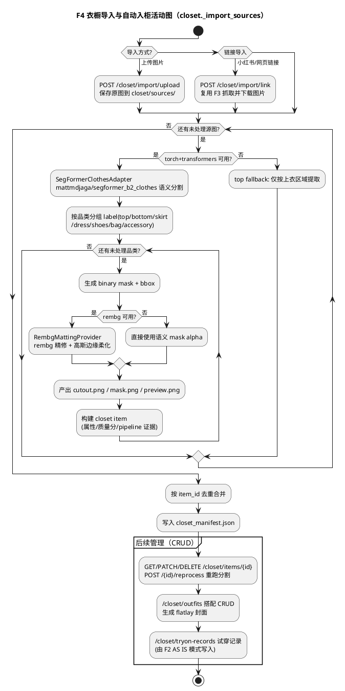

### 6.2 Mermaid 流程图

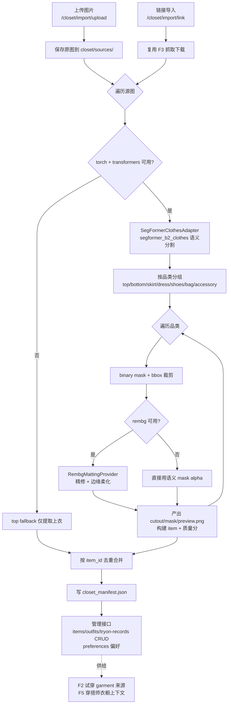

### 6.3 流程说明

- **核心能力**：`closet.py` 把"一张图"自动拆成"多件带透明背景的品类单品"。分割走 `SegFormerClothesAdapter`（HuggingFace `mattmdjaga/segformer_b2_clothes`，懒加载），边缘精修走 `RembgMattingProvider`（rembg + onnxruntime），两者都可用环境变量关闭或降级。
- **品类覆盖**：top / bottom / skirt / dress / shoes / bag / accessory 七类，通过 `SEGFORMER_LABEL_CATEGORY_HINTS` 把分割 label 映射到业务品类。
- **重模型可选**：未安装 `requirements-ai.txt`（torch/transformers/rembg）时服务照常启动，入柜降级为"仅上衣提取"的 fallback，`GET /closet/capabilities` 如实上报能力状态。
- **数据结构**：item 携带 `source`（来源图与 crop_box）、`assets`（cutout/mask/preview 路径）、`attributes`（颜色/材质/版型/风格标签）、`quality`（usable/review/rejected + 分数）、`pipeline`（分割与抠图 provider 证据），全部 JSON 落盘。
- **三个清单**：`closet_manifest.json`（单品）、`outfits_manifest.json`（搭配，含 flatlay 封面与 scene_tags）、`tryon_records_manifest.json`（试穿记录，由 F2 的 AS IS 模式写入）。这三个清单正是 F5 穿搭师的全部"衣橱事实来源"。

---

## 7. F5 AI 穿搭师对话流程（`POST /stylist/chat`）

### 7.1 UML 时序图（PlantUML）

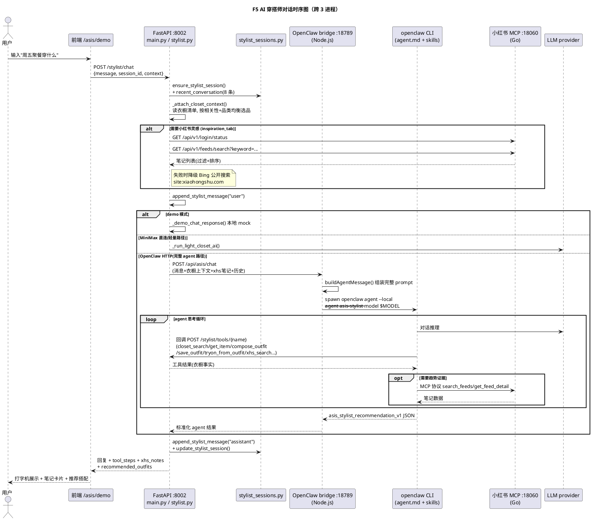

### 7.2 Mermaid 时序图

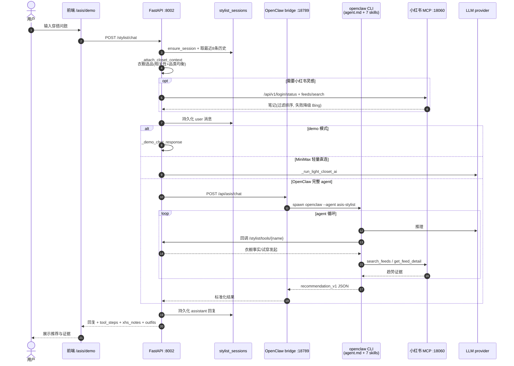

### 7.3 流程说明

- **三进程拓扑**：FastAPI（业务与工具事实源）↔ OpenClaw bridge（`:18789`，Node.js HTTP 桥，`asis-agent-runtime/scripts/asis-openclaw-bridge.mjs`）→ spawn `openclaw` CLI 子进程加载 `agents/asis-stylist/agent.md` 与 7 个 skills；小红书 MCP（`:18060`，Go）对两侧分别提供 REST（FastAPI 灵感搜索）与 MCP 协议（agent 工具）两种接入。
- **四级路由**：`run_stylist_chat()` 按配置依次选择：demo mock（零依赖演示）→ MiniMax 直连轻量路径 → OpenClaw HTTP（完整 agent）→ OpenClaw CLI；全不可用时返回 503 `ai_unavailable` 而非伪造回答。模型经 `STYLIST_OPENCLAW_MODEL`（如 `openai/gpt-5.5`、`google/gemini-2.5-flash`、`minimax/MiniMax-M3`）路由，provider 前缀与 API key 不匹配时直接报不可用。
- **数据边界铁律**（写在 agent.md 硬性规则里）：agent 只能通过 asis tools（`POST /stylist/tools/{name}`，8 个工具）获取衣橱/搭配/试穿/小红书数据，不允许直接读 manifest、不允许捏造单品与证据；所有写操作（保存搭配、发起试穿）也以工具形式回调 FastAPI 完成。
- **7 个场景技能**：color-match、ootd-breakdown、capsule-wardrobe、travel-outfit、wedding-guest-outfit、interview-outfit、xhs-trend-research，由 OpenClaw 按用户意图自动匹配，前端也可通过 `context.requested_skills` 显式指定。
- **会话与记忆**：会话以 JSON 文件存于用户目录下（`stylist_sessions/`，原子写入），每轮带入最近 8 条历史；跨会话长期记忆由 bridge 的 `/api/asis/memory/{user_id}` 维护，FastAPI 侧 `/stylist/memory` 仅做代理。
- **证据链透传**：小红书笔记、工具步骤（`tool_steps`）、证据来源（`evidence_sources`）随响应返回前端，用于"推荐理由有据可查"的产品表达。

---

## 8. F6 认证与多用户数据隔离流程（`/auth/*` + storage）

### 8.1 UML 时序图（PlantUML）

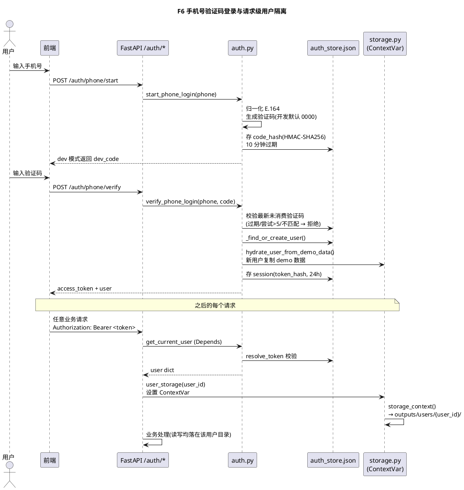

### 8.2 Mermaid 时序图

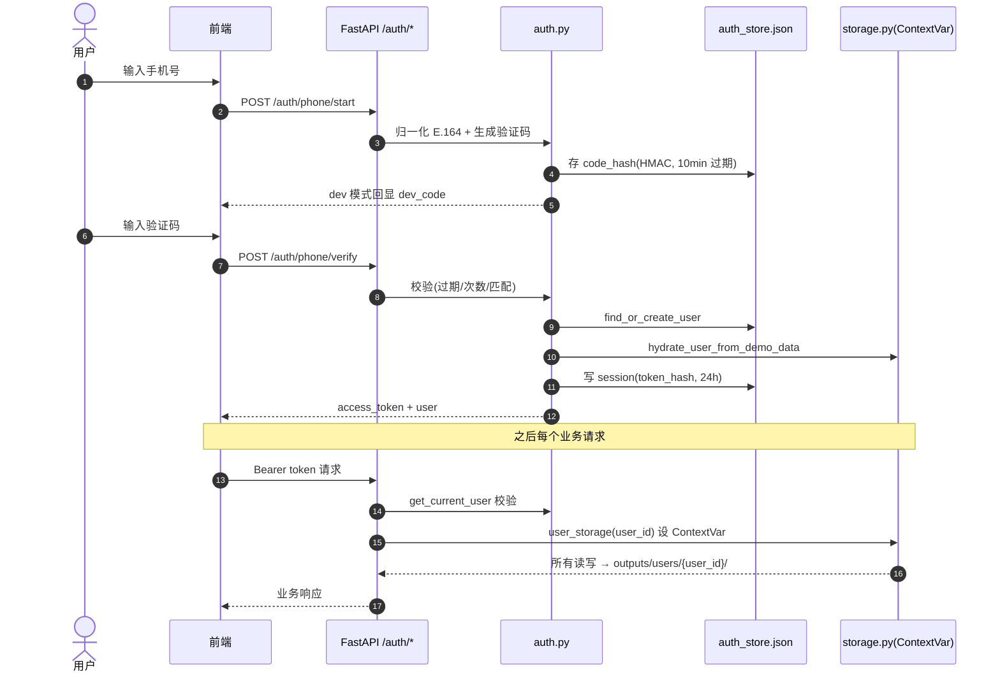

### 8.3 流程说明

- **认证方式**：手机号 + 验证码 + Bearer Token，无密码。验证码与 token 均只存 HMAC-SHA256 哈希；单文件 `outputs/auth/auth_store.json` 承载 users / codes / sessions 三张"表"。
- **隔离机制**：`storage.py` 用 `ContextVar` 保存当前请求的 `user_id`，`StorageContext`（frozen dataclass，14 个路径字段）把该用户的所有目录计算集中在一处；业务代码不感知路径拼接，天然避免越权读写其他用户目录。未登录场景回落到 `local_user`。
- **演示友好**：新用户首次登录时从 demo 数据水合（`hydrate_user_from_demo_data`），立即可体验完整产品；`ASIS_AUTH_DEV_CODE` / `ASIS_AUTH_RETURN_DEV_CODE` / `ASIS_AUTH_ALLOW_MOCK_CODES` 三个开关在公网 demo（`ASIS_PUBLIC_DEMO=1`）下必须关闭。
- **配套防护**：`ops.py` 中间件对 `/auth/phone/*` 限 20 次/小时、上传类 60 次/小时、AI 类 30 次/小时，请求体上限 36MB；`scripts/cleanup_user_outputs.py` 定期清理过期体验数据。

---

## 9. 存储与文件布局（现状）

```
app/
├── main.py              # 全部路由（未用 APIRouter），静态页与静态目录挂载
├── analyzer.py          # F1 编排：8 stage、决策、result_summary、fixture 回放
├── cv_pipeline.py       # F1 本地 CV：人脸/色卡/校正/肤色/对比度/季节型
├── tryon.py             # F2/F3：试穿 pipeline、provider 抽象、小红书抓取
├── closet.py            # F4：SegFormer 入柜、rembg 精修、清单 CRUD、内嵌 demo 页
├── stylist.py           # F5：对话路由、衣橱/小红书上下文注入、工具分发
├── stylist_sessions.py  # F5：JSON 会话存储（原子写）
├── auth.py              # F6：验证码/token，单 JSON 文件
├── storage.py           # ContextVar 用户上下文 + StorageContext
├── ops.py               # 限流中间件、部署模式、门禁报告
├── models/              # MediaPipe tflite / face_landmarker.task（仅本地模型文件）
└── static/              # 各 demo 页面前端

outputs/                 # 运行时数据（gitignore）
├── users/{user_id}/
│   ├── closet/          # sources / items / outfits / *_manifest.json / stylist_sessions/
│   ├── tryon/           # {tryon_id}/ 工作目录 + codex_bridge/ 异步队列 + xhs/ 缓存
│   └── preferences.json
├── auth/auth_store.json
└── runtime/             # sidecar 日志

tests/
├── fixtures/            # 53 个色彩用例 + expected.json + tryon_models 模特图
└── results/             # 自测 JSON、HTML 报告、contact sheet
```

关键事实：**无数据库、无 Pydantic 模型**（全部 plain dict + JSON manifest），`app/models/` 只放 CV 模型权重。

---

## 10. 部署拓扑（现状）

| 模式 | 命令 | 说明 |
|------|------|------|
| 本地最小（仅色彩 MVP） | `uvicorn app.main:app --port 8000` | 只装 `requirements.txt`，无 AI 依赖 |
| 本地全栈 | `./scripts/start_asis_full_stack.sh` | 并行拉起 FastAPI:8002 + OpenClaw bridge:18789 + XHS MCP:18060，结束后自动清理 |
| 公开 demo（Docker） | `docker compose -f docker-compose.demo.yml up -d` | 需 `.env.demo`：强随机 `ASIS_AUTH_SECRET`、关闭 dev code、配置限流 |
| 公开 demo（裸机） | `ASIS_ENV=demo ASIS_PUBLIC_DEMO=1 ./scripts/deploy_demo.sh` | 守护进程方式 |

自检链路：`/health` → `/health/dependencies` → `scripts/check_runtime_readiness.py [--strict]` → `scripts/wait_for_demo_readiness.py --require-sidecars`（放量前）。严格模式会真实调一次 `/stylist/chat` 验证模型 key 有效。

---

## 11. Provider 选择矩阵与降级策略（验证期架构核心）

| 能力 | 优先 | 次选 | 兜底 | 能力上报端点 |
|------|------|------|------|--------------|
| 衣服要素理解 | OpenAI 兼容 VLM（`:8787/v1` 或 `TRYON_OPENAI_BASE_URL`） | — | 本地 CV（颜色/纹理/bbox） | `/try-on/capabilities` |
| 试穿图像编辑 | RunwayGoogle → OpenAI `images.edit` → CodexBridge 异步队列 | — | Mock（仅验收注入）/ Unavailable（不展示伪图） | `/try-on/capabilities` |
| 入柜分割 | SegFormer b2_clothes + rembg 精修 | 语义 mask 无精修 | 仅上衣 fallback | `/closet/capabilities` |
| 穿搭师对话 | OpenClaw HTTP（agent + skills） | MiniMax 直连 / OpenClaw CLI | demo mock / 503 | `/stylist/capabilities` |
| vl_review（色彩） | MockVisionReviewer（fixture 回归） | 本地 CV 风险初筛（真实上传） | OpenAIVisionReviewer（预留未启用） | — |
| 小红书数据 | MCP sidecar 登录态搜索 | og 元数据封面 | Bing 公开搜索降级 | `/asis/runtime-readiness` |

统一原则：**能探测就探测，探测失败如实降级并在 evidence.provider / capabilities 里标记，绝不伪造能力**。

---

## 12. 现状限制与后续演进方向

**现状限制（as-is）**

1. 单进程 + 文件系统：并发能力受单机限制，JSON manifest 无事务、无索引，用户量上去后需引入数据库（manifest → 表结构）与对象存储（图片 → OSS）。
2. 重 AI 依赖（torch/transformers/rembg）与应用同进程，首次请求懒加载导致冷启动慢；试穿图像编辑为同步 HTTP 调用，长耗时占用连接（CodexBridge 队列是异步化的雏形）。
3. 认证为单文件 JSON，验证码无真实短信通道（开发固定码）；限流为单机内存滑动窗口，多实例部署即失效。
4. 色彩诊断与试穿均为"验证期规则/外链模型"，置信度被人为上限保护；`vl_review` 的本地 CV 初筛不等于完整语义理解。
5. 小红书抓取依赖公开 HTML 结构，易受反爬/改版影响。

**README 已规划的下一步**

1. 更强人脸关键点模型替换 Haar 兜底，补齐姿态/眼/唇/脸颊定位；
2. `vl_review` 接入正式 VL API；
3. 专业标注实拍样本校准肤色/对比度/季节型阈值；
4. 完善色卡校正矩阵，降低环境光偏差。

**架构层面建议的演进（to-be 候选）**

- 存储：manifest → SQLite/Postgres；图片 → 对象存储 + CDN；`outputs/users/{uid}` 的目录语义可直接映射为表 + bucket 前缀。
- 任务化：试穿生成、入柜分割改为队列 + worker（CodexBridge 的 job 文件机制可直接平移到 Redis/Stream）。
- 服务拆分：AI 推理（分割/编辑/VLM）与 Web 层分离，按 GPU/CPU 资源独立伸缩；sidecar 拓扑已具备雏形。
- 观测：把 `/mvp/status`、`acceptance_gates`、capabilities 系列端点接入正式监控告警。

---

## 附：文档与代码索引

| 主题 | 文档 | 代码 |
|------|------|------|
| 色彩 MVP 验证 | `docs/MVP_VALIDATION.md`（`/mvp/handoff`） | `app/analyzer.py`、`app/cv_pipeline.py` |
| 算法说明 | `docs/ALGORITHM_EXPLAINER.md`（`/mvp/algorithm`） | 同上 |
| 开源选型 | `docs/OPEN_SOURCE_TECH_SELECTION.md` | `app/models/` |
| 试穿验证 | `docs/TRYON_MVP_VALIDATION.md` | `app/tryon.py` |
| 交互计划 | `docs/AS_IS_INTERACTION_PLAN.md` | `app/closet.py`、`app/stylist.py` |
| 数据 Schema | `docs/ASIS_DATA_SCHEMA.md` | `app/storage.py` |
| Agent runtime | `asis-agent-runtime/README.md`、`agents/asis-stylist/agent.md` | `asis-agent-runtime/` |
| 启动/验收脚本 | `README.md` | `scripts/start_asis_full_stack.sh`、`scripts/*acceptance*.py` |
