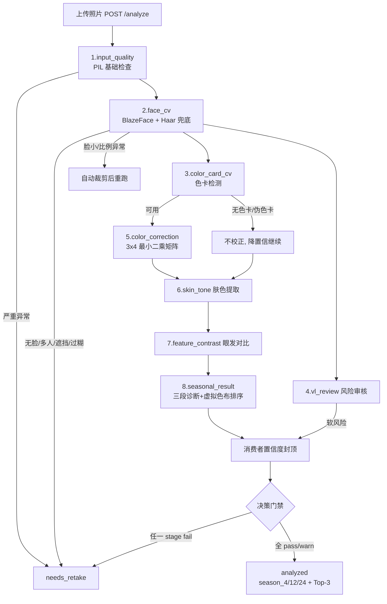

# 01 · 现状算法详解（攻坚基线）

> 本文档沉淀对现有管线的完整逆向分析。攻坚期的任何改动都应先对照本文档确认影响面。
> 代码位置：`app/cv_pipeline.py`（2314 行，全部真实计算）、`app/analyzer.py`（6317 行，编排/门禁/聚合）。

## 1. 管线全貌



## 2. 逐模块现状与阈值清单

| 阶段 | 实现 | 关键算法 | 硬编码阈值（攻坚期重点校准对象） |
| --- | --- | --- | --- |
| input_quality | PIL 统计 | 灰度均值判曝光；FIND_EDGES 方差判清晰度 | 分辨率 ≥720px；纵横比 0.45~1.8；亮度 <45/>220 阻断；清晰度 <140 阻断、<160 warn |
| face_cv | MediaPipe BlazeFace（`blaze_face_short_range.tflite`）+ Haar 正/侧脸兜底 | IoU≥0.35 去重；主脸面积≥3×次脸则抑制 | 脸部占比 <0.08 阻断；脸部 Laplacian <18 阻断、<110 软提示；遮挡启发式（墨镜/口罩 HSV 规则） |
| color_card_cv | Hybrid：colour-checker-detection segmentation 优先 → OpenCV 色块网格聚类兜底 | 24 格 4×6 采样；ColorChecker 形态画像（上18彩色/下6中性灰、底部明度跨度≥60、色相分箱≥6）防伪卡 | 面积占比 ≥5.5%；倾斜 ≤8°；反光率 ≤10%；皮肤遮挡率 ≤34% |
| color_correction | 24 patch 中位 RGB → `lstsq` 解 3×4 仿射矩阵 | colour-science 输出 CIE2000 DeltaE before/after | quality 分档：≤8 excellent / ≤14 good / ≤22 usable |
| **skin_tone** | MediaPipe Face Landmarker 478 关键点定位 4 区（额/双颊/下颌），失败回退人脸框比例 | 三重肤色 mask（HSV+YCrCb+RGB 规则）→ 区域中位数 → 稳定区优先 → 保守校正混合（强度 0.22~0.45 按校正距离分档） | warmth = b*−0.35a*：≥8 warm / ≤4 cool；L* ≥67 light / ≤52 deep；C*=√(a²+b²) ≥25 bright / ≤16 且 S≤24 muted |
| feature_contrast | Landmarker 眼部 bounds 框 + 发际比例框 | 非肤色暗像素采样（hair≤118/eye≤135 灰度），取 35/45 百分位亮度 | delta = 皮肤亮度 − 特征亮度：≥78 high / ≤38 low |
| vl_review | fixture 重放 Codex 标注；真实上传走本地启发式 | 口红（嘴-颊红度差）、腮红（颊-额红度差）、滤镜（RGB 通道极差）、美颜（纹理过低而清晰度高）、刘海（额头暗色比）、手托脸（脸侧皮肤比） | 全部启发式阈值，见 `run_local_visual_risk_review` |
| **seasonal_result** | 三段连续分数 → 12 季虚拟色布画像打分 → softmax | 基础分 = 0.42·温度 + 0.34·深浅 + 0.24·净柔；叠加 ~40 条手工特例规则；softmax T=0.16 | 权重 0.42/0.34/0.24、三段分数公式系数、40 条特例加减分全部是手工魔法数字 |
| 置信度封顶 | `_consumer_confidence_cap` | 按问题码取最低 cap | 规则模型 cap 0.76；浓妆/滤镜 0.62；美颜/无色卡 0.70；裁剪 0.75 |

## 3. 季型判断三步法（攻坚主战场细节）

```mermaid
flowchart LR
    SKIN[skin_tone: Lab/HSV/warmth] --> L
    FEAT[feature_contrast: 发/眼亮度/delta] --> L
    subgraph L[三段连续分数诊断]
        T[温度: warm/cool/neutral 各0~1<br/>warm=(warmth-3)/8 等]
        D[深浅: light/medium/deep<br/>含发暗度+眼暗度修正<br/>feature_depth=0.58·min发眼+0.28·眼+0.14·发]
        C[净柔: clear/balanced/soft<br/>彩度+饱和+对比度辅助]
    end
    L --> R[12季色布画像打分<br/>SEASON_DRAPE_PROFILES]
    R --> R2[~40条手工特例<br/>亚洲黑发抑制bright_spring<br/>deep_winter高对比加成等]
    R2 --> SM[softmax T=0.16 → probability_percent]
    SM --> OUT[Top-3候选 + ambiguous_between<br/>+ uncertainty_flags<br/>no_card/depth_uncertain/close_candidates/asian_high_contrast_risk]
```

## 4. 评估闭环现状

- `tests/fixtures/expected.json`：53 例，其中 8 例 `seasonal_gold` 季节金标。
- **关键风险：8 例季节金标全部是 `scripts/build_mvp_fixtures.py` 的 PIL 合成图**——同一张 AI 生成底图上画椭圆皮肤、矩形头发、椭圆眼睛，再整体调亮度/饱和度。Top-1 100% 的口径是「规则复现规则的理想化输入」。
- `_seasonal_accuracy_metric` 计算 Top-1/Top-2 命中率，验收门槛 70%/85%。
- QA 设施完备：`/fixtures/{id}/explain`（单样本维度证据）、`/qa-artifacts/overlays/*.jpg`（采样区域可视化）、`/mvp/seasonal-evaluation`（金标评估聚合页）。

## 5. 已识别短板清单（按优先级）

| # | 短板 | 影响 | 对应攻坚方案 |
| --- | --- | --- | --- |
| 1 | 无色卡路径无光照归一化 | 冷暖（b* 轴几个单位的差异）被室内暖光完全翻转 | 子文档 04 |
| 2 | 净柔用绝对 C\*+饱和度，随 illuminant 漂移 | 净/柔误判 | 子文档 04 |
| 3 | 金标是合成图，阈值无真实数据校准 | 40 条手工规则和 0.42/0.34/0.24 权重不可信 | 子文档 02（数据）→ 06（长期模型化） |
| 4 | 单张照片单通道信号，无问卷交叉验证 | tie-break 场景全靠像素硬扛 | 子文档 03 |
| 5 | 肤色采样是「关键点框+规则 mask」，腮红/刘海/手污染只能绕不能除 | 采样质量 | 子文档 05（face parsing） |
| 6 | OpenCV 8bit Lab 与 colour-science 标准 Lab 口径混用 | 调试噪音 | 子文档 04 顺手统一 |
