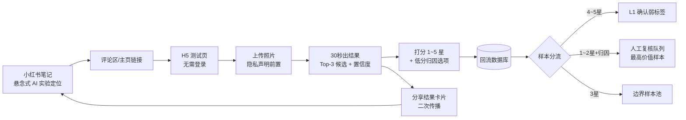

# 02 · 线上数据冷启动方案（冲刺期最高优先级）

> 核心命题：**不用顾问、不花标注费，把「数据收集」包装成「免费 AI 季型测试」本身**，让用户为了拿到结果而主动贡献规范照片 + 自评反馈。
> 时间约束：半周内上线并发出小红书帖子，开始回收第一批数据。

## 1. 总体策略

**为什么这个模式成立**：
- 用户动机是「免费获得季型判断」（韩国线下店要几百元，AI 竞品要 $9.9/月），我们免费。
- 数据动机藏在「帮 AI 变得更准」的参与感里——用户是「AI 训练师」，不是「被采集对象」。
- 低分样本恰好是最有价值的数据：高分样本只确认「规则对了」，低分样本告诉你「规则在哪错」。

## 2. 工具页改造清单（最小可行，半周内完成）

现有 demo 页（`render_demo_page` + `/analyze` + `allow_demo_fallback`）已经接近可用，需要的最小改动：

| # | 改造项 | 说明 | 工程量 |
| --- | --- | --- | --- |
| 1 | **去掉登录依赖** | 公开路由，不调 `get_current_user` | 小 |
| 2 | **隐私声明前置** | 上传按钮上方固定文案（见 2.1），点「同意并开始测试」才激活上传 | 小 |
| 3 | **结果页改为 Top-3 候选呈现** | 主倾向 + 2 个备选 + 各自概率百分比；现有 `top_candidates` 数据直接可用 | 中 |
| 4 | **评分 + 归因组件** | 结果页底部：1~5 星；≤3 星时展开归因多选（见 2.2）；可选「我觉得我的真实季型是 ___」下拉 | 中 |
| 5 | **追问/补拍引导** | 当 `close_candidates` flag 命中（Top1-Top2 分差小）时，展示 2 道追问题或引导补拍自然光照/手腕照（见子文档 03） | 中 |
| 6 | **分享卡片生成** | Canvas 生成小红书比例结果图（3:4），含季型名 + 适合色板 + 「免费测同款」引导 | 中 |
| 7 | **回流存储** | 新表/新 JSONL：`{photo_id, pipeline_evidence, top_candidates, rating,归因codes, 用户自报季型?, timestamp}`。**只存特征与结果，不存任何身份标识** | 小 |

### 2.1 隐私声明文案（用户硬性要求，放在上传前）

> **开始测试前请知悉：**
> - 无需登录、无需注册，我们不收集手机号、账号或设备标识。
> - 你的照片仅用于本次分析和算法效果调优。
> - 我们不会记录任何与你个人身份相关的信息。

技术兜底（声明必须真实）：不存 IP-账号映射、不写用户表、照片与反馈只通过随机 `photo_id` 关联、日志脱敏。

### 2.2 评分与归因设计（关键设计决策）

**不问「你是什么季型」作为主答案**——用户恰恰不知道自己是什么型（这正是他们来测的原因），自报答案噪声极大。改问「哪个维度感觉不对」：

- 评分：1~5 星（「这个结果符合你的感觉吗？」）
- ≤3 星时展开归因多选：
  - 冷暖判反了（我戴银更好看但说我偏暖 / 反之）
  - 深浅不对（我明明黑发浓颜被说浅 / 反之）
  - 净柔不对（说我适合艳色但我穿灰调才好看 / 反之）
  - 照片没拍好（光线差 / 带妆 / 有美颜）
  - 完全不对
  - 说不上来，就是感觉不对
- 可选增强（不强制）：「如果你做过专业色彩诊断/自测，你的季型是 ___」（下拉 12 季 + 「不确定」）

**分流规则**：
- 4~5 星 → L1 确认弱标签（权重低，仅作分布校准）
- 1~2 星 + 归因 → **人工复核队列**，按归因类型聚合分析（例：若「冷暖判反」集中出现在室内暖光照片 → 直接验证光照归一化的必要性）
- 自报了真实季型的 → 升级为准金标候选，人工复核后可用

## 3. 小红书营销方案（只推测试工具，不提产品，卖关子）

### 3.1 账号与内容定位

- 定位：**「一个在学看脸色的 AI」养成记录**。全程不提衣橱/试穿产品，只讲「我们在训练一个测季型的 AI，需要真实的人帮它变准」。
- 卖关子的点：AI 现在什么水平？准不准？来测测看——悬念本身就是点击动机。

### 3.2 笔记内容矩阵（按发布顺序）

| 波次 | 选题 | 钩子 | 目的 |
| --- | --- | --- | --- |
| 第 1 波（发工具当天） | 「我做了个 AI，30 秒测出你的十二季型，免费，求虐」 | 免费 + 求挑战姿态 | 直接引流 |
| 第 1 波 | 「80% 的人都搞错自己的冷暖皮，这个 AI 说它能测准」 | 认知冲突 | 泛流量 |
| 第 2 波（有数据后） | 「AI 测了 500 个人，这 3 种脸它最容易判错」 | 真实数据 + 好奇心 | 二次引流 + 建立「在认真迭代」的信任 |
| 第 2 波 | 「韩国 800 块的色彩诊断 vs 免费 AI，结果一样吗」 | 价格锚点对比 | 破圈 |
| 持续 | 参与者晒单转发（结果卡片自带分享属性） | UGC | 自传播 |

### 3.3 关键转化细节

- **评论区置顶**：「不用登录，照片只用来看结果和帮 AI 学习，不记录任何身份信息」——隐私顾虑是上传转化率的最大杀手，必须在评论区主动说。
- **结果卡片即裂变物料**：小红书比例（3:4）、浅色系、季型名 + 3 个本命色 + 「我是浅夏型，你呢？」文案 + 工具入口。分享动作零成本。
- **参与感话术**：「前 1000 名参与者的反馈会直接用来训练下一代模型，你是 AI 训练师」——把打分行为从「施舍」变成「身份」。
- **标签**：#四季色彩 #十二季型 #个人色彩诊断 #冷暖皮 #暖皮冷皮 #AI测试
- **发布时间**：工作日晚 8~10 点、周末下午；小红书美妆/穿搭流量高峰。
- **冷启动**：自有账号发 + 朋友转发 + 相关笔记评论区自然互动（不硬广，回答季型问题顺便提工具）。

### 3.4 风险与对策

| 风险 | 对策 |
| --- | --- |
| 流量不及预期 | 笔记矩阵至少 3 篇不同角度；同步发即刻/微博/豆瓣小组（「四季十二型」小组是精准人群） |
| 照片质量差（带妆/滤镜/光线差） | 上传页放 3 张示例图引导「窗边自然光素颜照」；质量门禁现有管线已能拦 |
| 恶意/无关上传 | 现有 face_cv 门禁（非人脸/多人/遮挡直接 needs_retake）已覆盖 |
| 合规投诉 | 声明真实可验证；提供「删除我的数据」入口（凭结果页 photo_id 自助删除） |
| 用户刷分/乱归因 | 归因只做聚合分析不做单样本 ground truth；单样本权重由人工复核决定 |

## 4. 半周冲刺时间表

**前置约束：M0（P0 光照归一化，子文档 04）必须在 Day 3 发布前通过 E1/E2/E3 验证**。不归一化就引流，回收的评分与归因数据本身是脏的。

| 时间 | 交付物 | 负责模块 |
| --- | --- | --- |
| Day 1 上午 | 公开路由 + 去登录 + 隐私声明页 | 工具页 |
| Day 1 下午 | **P0：`estimate_illuminant_gains` + color_correction 统计法分支 + skin_tone 适配**（子文档 04 §4） | **算法（P0）** |
| Day 2 上午 | **P0：E1 合成色温漂移 + E2 发散放弃 + E3 回归实验通过**（04 §5） | **算法（P0）** |
| Day 2 上午（并行） | 结果页 Top-3 候选展示 + 评分归因组件 | 工具页 |
| Day 2 下午 | 回流存储 + 复核队列导出脚本；净柔新特征并行接入（04 §4.5） | 数据管道 + 算法 |
| Day 3 上午 | 分享卡片生成 + 全链路自测（手机 390px 宽度检查）；第 1 波 2 篇笔记制作 | 工具页 + 内容 |
| Day 3 下午 | 发布 + 评论区运营话术就位 | 内容 |
| Day 4~5 | 流量承接、数据监控、第一批低分样本人工复核启动 | 运营 + 算法 |

## 5. 现实预期管理

- 小红书单篇素人笔记自然流量通常几百到几千曝光，转化率按 1~5% 估：**第一篇笔记预期回收 50~300 个有效样本**；多篇 + 二次传播叠加，两周目标 300~1000 个。
- 这批数据的定位是 **L1 回流弱标签 + 系统性偏差探测器**，不是训练金标。它能回答的问题是：「规则在真实世界哪个维度上错得最离谱」，从而指导迭代期的算法改造优先级。
- 真正的训练金标（L2 顾问标注）和测试集（L3 色布实测）在长期计划中，见子文档 06。

## 6. 与长期计划的衔接

| 短期（本方案） | 长期（子文档 06） |
| --- | --- |
| L1 用户自评回流 | L2 顾问双盲标注 1000~1500 人 |
| 低分样本人工复核（自己看） | L3 线下色布披挂实测 150~300 人 |
| 归因聚合发现系统偏差 | κ 一致性质控、标注协议 pilot |
| 无成本 | 顾问费 + 场地费 + 被试费 |

回流数据中的所有「用户自报季型」样本，在长期阶段可作为顾问标注的**预筛队列**（顾问先看这些样本，效率翻倍）。
