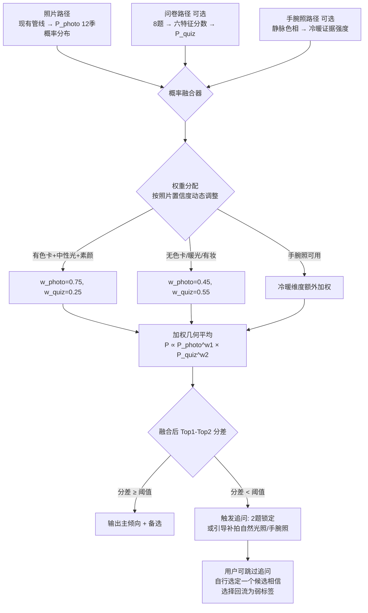

# 03 · 混合推断设计：问卷 + 手腕照 + 照片融合

> 原则：**有则融合、无则纯照片**。所有增强通道（问卷、手腕照、追问）都是可选的；用户全部跳过时，管线退化为现有纯照片路径。
> 理论依据：调研文档结论「可靠的产品形态是规范照片 + AI 特征提取 + 少量问卷交叉验证的混合方案，而非纯照片端到端分类」。

## 1. 三通道总体结构



## 2. 问卷设计（8 题，全部可跳过）

| 题 | 选项 | 映射维度 | 分数向量（答对方向 +1） |
| --- | --- | --- | --- |
| Q1 未染发的天然发色 | 乌黑 / 深棕 / 中棕 / 浅棕偏黄 | 深浅 | 乌黑→deep；浅棕→light |
| Q2 瞳孔颜色 | 纯黑 / 深棕 / 琥珀浅棕 / 偏灰偏绿 | 深浅、净柔 | 纯黑→deep+clear；浅棕→light+soft |
| Q3 手腕内侧血管颜色（自然光） | 偏绿 / 蓝紫 / 说不清 | 冷暖 | 绿→warm；蓝紫→cool；说不清→不计分 |
| Q4 金银首饰哪个显气色好 | 金 / 银 / 差不多 | 冷暖 | 金→warm；银→cool；差不多→中性 |
| Q5 晒后反应 | 容易晒黑 / 容易晒红 / 都有 | 深浅、冷暖 | 晒黑→deep+warm；晒红→light+cool |
| Q6 穿纯黑上衣的效果 | 显精神 / 显憔悴显老 / 一般 | 深浅、对比 | 精神→deep；憔悴→light |
| Q7 穿正红/宝蓝等高饱和色 | 撑得住显白 / 被颜色吃掉 | 净柔 | 撑住→clear；吃掉→soft |
| Q8 穿莫兰迪灰调色的效果 | 显高级 / 显没精神 | 净柔 | 高级→soft；没精神→clear |

问卷路径产出：六特征分数 → 用与照片路径**同一套** `SEASON_DRAPE_PROFILES` 打分 → 同样过 softmax 出 P_quiz。这样两条路径的输出在同一概率空间，融合才成立。

## 3. 手腕照通道（可选上传）

- **作用**：静脉色相是冷暖的强证据（绿→暖、蓝紫→冷），且不受妆容/滤镜影响——正好补照片路径的最大短板。
- **工程方案**（无现成开源模型，自研）：
  1. 肤色区域分割：复用现有 `_skin_mask_rgb`
  2. 静脉增强：绿色通道提取 + CLAHE 对比度增强（静脉在绿光下对比最强）
  3. 细线结构提取：Frangi vesselness 滤波（scikit-image 自带 `skimage.filters.frangi`）
  4. 静脉像素 HSV 色相统计 → 绿/蓝紫倾向分数
- **降级策略**：照片质量不达标（模糊/光线差/静脉不可见）→ 该通道置零权重，不报错不阻断。
- **风险**：手机微距拍不清静脉的概率不低，先离线验证 50 人再决定是否上线；若不可用，退回 Q3 自问自答。

## 4. 融合规则

```
P_final(season) ∝ P_photo(season)^w1 × P_quiz(season)^w2 × P_wrist(season)^w3
```

| 场景 | w_photo | w_quiz | w_wrist |
| --- | --- | --- | --- |
| 照片高置信（有色卡+中性光+素颜）+ 问卷完成 | 0.75 | 0.25 | 冷暖维度额外叠加 |
| 照片低置信（无色卡/暖光/有妆）+ 问卷完成 | 0.45 | 0.55 | 同上 |
| 仅照片（用户全跳过） | 1.0 | 0 | 0 |
| 仅问卷（照片被门禁拦住但问卷完成） | 0 | 1.0 | 降级输出，标注「仅供参考」 |

**冲突处理**：照片 Top-1 与问卷 Top-1 不一致时，不强行二选一——输出双候选并列，文案「这两个季型在你身上都有依据」，并引导补拍或追问。

## 5. 多候选展示与追问机制（产品形态核心）

基于 kappa 天花板认知（见总纲第 3 节），结果页固定展示 **Top-1 主倾向 + Top-2/3 备选 + 各自概率百分比**。

### 5.1 追问触发条件

- `close_candidates` flag 命中（现有 uncertainty_flags 已产出：Top1-Top2 概率差 <8%）
- 或 `temperature == neutral`、`depth_uncertain` 等 flag 命中

### 5.2 追问内容（按缺失维度动态选题）

| 不确定维度 | 追问题 |
| --- | --- |
| 冷暖 | 「自然光下看手腕内侧血管：偏绿还是蓝紫？」或「补一张自然光手腕照」 |
| 深浅 | 「穿纯黑上衣：显精神还是显憔悴？」 |
| 净柔 | 「穿正红色：显白提气色，还是觉得衣服太抢？」 |
| 整体 | 「补拍一张窗边自然光素颜照，准确率会明显提升」 |

### 5.3 用户自主权（硬性要求）

- 所有追问和补拍引导都必须可跳过。
- 结果页提供「我更相信我是 ___」下拉（12 季 + 不确定），用户选定后：
  - 前端把选定项标为「我的认定季型」
  - 该选择回流为弱标签（比评分信号更强，仅次于自报+低分复核样本）
- 文案口径：「AI 给的是概率倾向，最了解你的人是你自己。」

## 6. 工程落地映射（改动量评估）

| 改动 | 位置 | 量 |
| --- | --- | --- |
| 问卷 → 六特征分数 → 复用 `SEASON_DRAPE_PROFILES` 打分 | 新增 `quiz_scoring.py`，复用 `cv_pipeline.py` 的 ranking/softmax | 小 |
| 概率融合纯函数 | `analyzer.py` 新增 `_fuse_photo_quiz()` | 小 |
| 追问触发逻辑 | 读现有 `uncertainty_flags` | 小 |
| 手腕照静脉分析 | 新增 `wrist_analysis.py`（scikit-image 一个依赖） | 中 |
| 结果页多候选 + 追问 + 锁定 UI | demo 页改造 | 中 |
| 回流存储扩展（问卷答案/锁定选择） | 子文档 02 的回流管道 | 小 |
