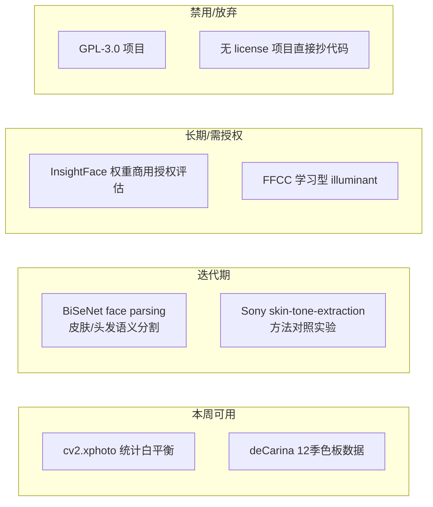

# 05 · 开源组件调研结论（2026-08 实地扒取）

> 调研方法：逐一访问 GitHub 仓库/API 确认存在性、活跃度、license、与管线的适配面。
> 总结论：**没有任何开源「季型分类器」可直接用作诊断引擎**（星数最高的同类项目 20★ 且 2023 年停更）；价值集中在底层模块与标注方法论。

## 1. 组件评估总表

| 组件 | 状态 | License | 对我们的价值 | 接入结论 |
| --- | --- | --- | --- | --- |
| **cv2.xphoto 白平衡** | 已在依赖中（`opencv-contrib-python==4.13.0.92`），含 GrayWorld/SimpleWB/LearningBasedWB | Apache-2.0 | 无色卡光照归一化的最快路径，零新依赖 | **立即接入**（子文档 04） |
| `zllrunning/face-parsing.PyTorch` | 2.6k★，BiSeNet+CelebAMask-HQ，19 类面部解析（皮肤/发/唇/眼/眉），有预训练模型；repo 多年未更新 | MIT | 皮肤/头发语义分割：根治腮红/刘海/手托脸污染采样；为净柔提供干净肤质区域 | **接入，P1**；现有关键点方案保留为 fallback |
| `deepinsight/insightface` | 29.5k★，SCRFD/RetinaFace 等 | 代码 MIT；**模型权重仅限非商业研究**（2025-11 起商用需联系 recognition-oss-pack@insightface.ai） | 检测/姿态思路参考 | **只作研究对照，不进生产**（除非拿到授权） |
| `SonyResearch/skin-tone-extraction` | 0★，极新，8 commits | MIT | 肤色提取方法集（average/mode/Thong聚类/Krishnapriya/Merler），输出 Lab/ITA/cITA；官方明确警告 ITA 对深肤色代表性差 | 方法参考；Thong et al. 2023 多维肤色度量与我们三维诊断同构 |
| `mrcmich/deep-seasonal-color-analysis-system` | 20★，课程项目，2023-02 停更 | 无 license | pipeline 结构参考 | 不用 |
| `lajota13/seasonal-color-analysis` | 3★ | **GPL-3.0**（传染性） | — | **禁用** |
| `Aaris03Khan/Phaino` | 2★，2026 新项目，ResNext-50 + LLM 单图出季型 | MIT | 端到端分类 + LLM 报告的架构思路 | 跟踪，不用 |
| 文档提及的 `SeasonalColourClassification` | GitHub 已搜不到（疑似删除/改名） | — | — | 放弃 |
| `shuwei666/ffcc-python` | 2★，FFCC（Google 2017）Python 复现 | Apache-2.0 | 学习型 illuminant 估计参考 | 备选参考（二期） |
| `MichailSemoglou/color-constancy-photo-enhancement` | 1★，GrayWorld/WhitePatch/VonKries/Retinex 合集 | MIT | 统计法参考实现 | 备选参考 |
| `google-research-datasets/scin` | 163★，10k+ 图像，**同时含 Fitzpatrick + Monk Skin Tone 标注** | NOASSERTION（需逐案确认） | Monk 肤阶标注方法论参照；内容是皮肤病灶图非美妆人脸 | 方法论参照，不训练 |
| `mattgroh/fitzpatrick17k` | 148★，16,577 张，Scale AI 标注 Fitzpatrick 6 级 | CC BY-NC-SA 3.0（非商业） | **标注方法论金矿**：专家/众包/算法三层 inter-rater 一致性分析可直接照搬到我们的标注集建设 | 方法参照，不商用训练 |
| `deCarina/12-season-palettes` | 1★，12 季色板数据 | 无 | 把「虚拟色布画像」从标签升级为真实色值 | 小规模可用 |
| 手腕静脉检测 | **无现成开源模型** | — | 自研：肤色 mask + 绿通道增强 + Frangi 血管滤波（scikit-image） | 自研，子文档 03 |

## 2. 分层接入建议

## 3. License 红线

- **GPL-3.0 传染性**：`lajota13/seasonal-color-analysis` 等一律不引入代码。
- **无 license = 保留所有权利**：只能看思路，不能抄代码。
- **InsightFace 权重**：生产环境使用前必须取得商用授权；代码框架（MIT）可自由参考。
- **数据集**：fitzpatrick17k（CC BY-NC-SA）与 scin（条款待确认）只作方法论参照，不进训练集。

## 4. 对「韩国学界个人色彩分类研究」的补充说明

文档提到韩国学界有个人色彩自动分类研究（퍼스널컬러 자동 분류）。本轮调研未找到可公开获取的代码或大规模标注数据集——这与「12 类季型无公认公开标注数据集」的判断一致。**数据只能自己建**，见子文档 02（线上冷启动）与 06（长期标注计划）。
