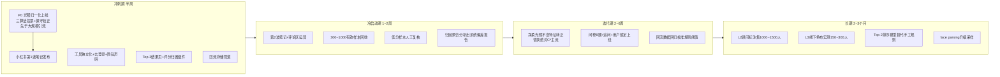

# 06 · 路线图与人工任务清单

> 约束前提：半周后面向第一批用户；顾问与线下方式暂不可用（写入长期计划）；经费紧张。
> 全部人工事项集中在第 3 节的表格里（含难易、耗时、指导路径、最大风险）。

## 1. 总路线图

## 2. 关键里程碑与验收口径

| 里程碑 | 时间 | 验收 |
| --- | --- | --- |
| M0 **P0 光照归一化上线** | Day 2 | 子文档 04 的 E1/E2/E3 实验通过；无色卡路径肤色 warmth 在合成色温漂移下收敛到 ±2 单位内 |
| M1 工具公开上线 | Day 3 | 无登录可访问；隐私声明前置；评分归因可提交；分享卡可生成 |
| M2 第一批数据回收 | Day 5~14 | ≥300 有效样本（有评分）；低分样本复核率 100% |
| M3 系统偏差报告 | 第 2 周末 | 归因聚合报告：哪个维度错最多、集中在什么光照/妆容条件 |
| M4 算法迭代 V2 | 第 6 周末 | 净柔特征转正 + 融合通道上线；回流数据上 Top-2 命中率可测量且回归通过 |
| M5 真实测试集锁定 | 第 3 个月 | L3 色布实测集建立并锁定；此后任何迭代只在验证集调参 |

## 3. 人工任务清单（按依赖排序）

| # | 任务 | 难易 | 预计耗时 | 指导路径 | 最大风险 |
| --- | --- | --- | --- | --- | --- |
| 0 | **【P0】光照归一化工程实施** | 中 | 1.5~2 天 | 子文档 04 全文（函数级改动点 + E1/E2/E3 验证实验）；`cv2.xphoto` 已在依赖中零新增 | 统计法在纯色背景自拍失效 → 投票发散即放弃校正；校正拉平真实冷暖 → 强度上限 0.3 + 肤色先验保护 |
| 1 | 工具页去登录化 + 隐私声明 | 易 | 0.5 天 | 公开路由；声明文案见子文档 02 §2.1，声明必须真实（不存身份标识、日志脱敏） | 声明与实际行为不一致 → 信任与合规事故 |
| 2 | 结果页 Top-3 + 评分归因组件 | 中 | 1 天 | 现有 `top_candidates` 数据直接用；归因选项按子文档 02 §2.2 | 归因选项设计引导性太强 → 回收数据失真 |
| 3 | 回流存储 + 复核队列 | 易 | 0.5 天 | JSONL/单表即可：`{photo_id, evidence, candidates, rating, codes, 自报季型?}` | 忘记做「凭 photo_id 自助删除」入口 |
| 4 | 分享卡片生成 | 中 | 0.5~1 天 | Canvas 画 3:4 结果卡：季型名 + 3 本命色 + 引导语；风格对齐小红书审美 | 卡片丑 → 二次传播断裂 |
| 5 | 小红书账号搭建 + 第 1 波笔记 | 中 | 1 天 | 选题矩阵见子文档 02 §3.2；封面即「结果卡片」样例 | 笔记限流：避免硬广话术，用「AI 实验/求虐/共建」口吻 |
| 6 | 评论区运营 | 易 | 持续，每天 0.5 小时 | 置顶隐私承诺；认真回复每个季型问题（建立专业人设） | 回复敷衍被识破是引流号 |
| 7 | 低分样本人工复核 | 中 | 第 1~2 周，每天 0.5~1 小时 | 看 overlay 采样图 + 归因码，按维度聚合；产出系统偏差报告 | 个人主观复核无第二人 → 结论偏差；缓解：只看聚合趋势，不逐样本下结论 |
| 8 | 问卷/追问/锁定功能上线 | 中 | 迭代期 1 周 | 子文档 03；复用现有 ranking + softmax | 用户乱填 → 照片-问卷冲突检测兜底 |
| 9 | 合规评估（PIPL 敏感个人信息） | 中 | 1~2 周（尽早启动） | 人脸=生物识别信息=敏感个人信息；无登录+不存身份标识的设计大幅降低风险，但上线前仍建议过一遍法务 | 合规返工 |
| 10 | 【长期】顾问资源敲定 | 难 | 2~4 周 | 三线并行：高校服设/形象专业教师；祺馨/西蔓类工作室「AI 引流换标注」；自由顾问按单付费 | 顾问间口径不一（κ 低）→ 先 30 人 pilot 测 κ 再签长期 |
| 11 | 【长期】L2 顾问标注 1000~1500 人 | 中（重组织） | 4~8 周 | 标注协议先行；双盲 + 仲裁；κ≥0.6 入训练集；12 类按最少类 ≥80 人倒推总量 | 深冬/净春等稀有型招不够 → 定向招募或类别合并降级 |
| 12 | 【长期】L3 线下色布实测 150~300 人 | 中 | 2~4 周（可与 11 并行） | 租场地 + 顾问现场 draping；从 L2 分层抽样（季型/Monk 肤阶/性别） | 照片标注与真人 draping 差距大 → 不是失败，是决定问卷/手腕照权重的关键数据 |
| 13 | 【长期】Top-2 排序模型训练 | 中 | 2~3 周（依赖 11） | 三段分数 + parsing 特征 → XGBoost/MLP；规则模型留作 baseline 与降级方案 | 数据量不够模型打不过手工规则 → 先用银标预训练再金标微调 |

## 4. 时间预算总览

| 阶段 | 人力投入 | 经费投入 |
| --- | --- | --- |
| 冲刺期（半周） | 约 3 人日 | ≈0 |
| 冷启动期（2 周） | 约 5 人日（含运营） | ≈0（不含自然流量） |
| 迭代期（4 周） | 工程为主，约 10~15 人日 | ≈0 |
| 长期（数据建设） | 组织工作约 15 人日 | 顾问费 + 被试费 + 场地费（主要成本，届时再立项评估） |

## 5. 失败预案

| 情况 | 预案 |
| --- | --- |
| 小红书流量起不来（2 周 <100 样本） | 转即刻/豆瓣「四季十二型」小组/微博；朋友裂变（结果卡片分享返利：解锁详细报告） |
| 回收照片质量普遍太差 | 强化拍摄引导（示例图 + 实时质检提示）；接受「先问卷后照片」的逆向流程 |
| 归因数据显示光照是最大问题 | 提前光照归一化的优先级（子文档 04），并在上传页强制引导「窗边自然光」 |
| 用户普遍不信任隐私声明 | 增加「分析完成后可立即删除我的照片」按钮 + 删除后提示；评论区分批晒「我们真的不存」的技术说明 |
