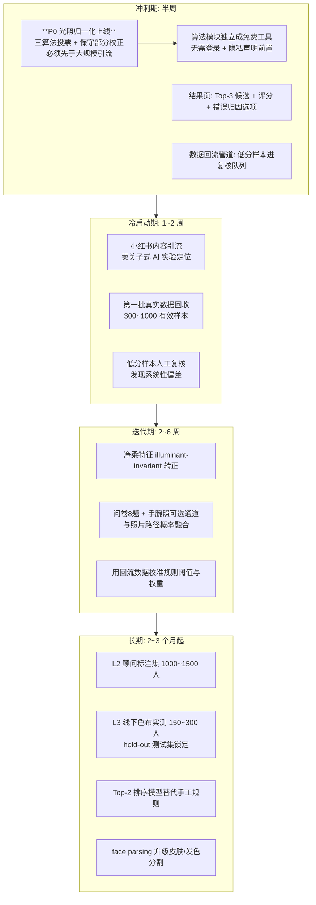

# 肤色与季型识别攻坚 · 总纲

> 本文档是「照片识别人体肤色 / 十二季型」攻坚方向的总入口。
> 目标读者：算法、产品、运营协同的攻坚小组。
> 子文档索引见第 6 节。

## 0. 一句话背景

当前 `/analyze` 管线是一条**可解释规则管线**（本地 CV 提取 Lab/HSV 指标 → 三维硬阈值 → 三段连续分数诊断 → 12 季虚拟色布打分 + softmax），不是端到端模型。它在 8 个 PIL 合成金标上跑出 Top-1 100%，但这个数字**不代表真实照片上的能力**。攻坚的目标是把「规则复现规则」变成「真实人群真实照片上可信的季型判断」。

## 1. 目标与时间线

| 阶段 | 时间 | 目标 | 验收口径 |
| --- | --- | --- | --- |
| 冲刺期 | 本周（半周） | 算法模块独立成免费公开工具上线，开始回收第一批真实数据 | 工具可公开访问、无需登录；回收通道（评分 + 归因）上线 |
| 冷启动期 | 第 1~2 周 | 小红书引流，回收第一批真实标注数据 | 300~1000 个有效样本（含评分与错误归因） |
| 迭代期 | 第 2~6 周 | 用真实数据校准规则阈值；问卷/手腕照融合上线；净柔特征改造 | 回流数据上 Top-2 命中率可测量、可回归 |
| 长期 | 第 2~3 个月起 | 顾问标注集（L2）、线下色布实测（L3）、学习排序模型 | 真实测试集 Top-2 ≥ 85%，按光照/妆容/肤阶分组达标 |

## 2. 现状三大结论（详细分析见子文档 01）

1. **算法底座可保留，但三个环节是明显短板**：无色卡路径没有光照归一化（最大误差源）、净柔判断用了会随光照漂移的绝对色度、季节打分是 ~40 条手工规则无数据校准。
2. **当前金标是 PIL 合成图**（`scripts/build_mvp_fixtures.py` 画椭圆皮肤 + 矩形头发），Top-1 100% 只证明规则能复现理想化输入。必须尽快换成真实数据。
3. **工程基建很好，直接复用**：fixture 结构（`expected.json`）就是标注格式雏形；`/fixtures/{id}/explain` 改成标注/复核界面几乎零成本；置信度封顶、Top-3 候选、uncertainty flags 都是现成的产品化资产。

## 3. 关键概念：什么是「inter-rater kappa 天花板」

这是本轮最重要的认知，直接影响产品形态和训练目标。

- **Cohen's kappa（κ）** 是衡量「两个标注员的一致性超出『随机碰巧一致』多少」的统计量。κ=1 完全一致；κ=0 等于随机猜测；κ=0.6~0.75 属于「中高度一致」。
- 十二季型是**经验美学体系而非严格科学分类**：不同专业顾问对同一个人也经常给出不同结论（业界普遍现象，调研文档第七节也确认）。即使花钱请最好的顾问双盲标注，κ 的实际上限也就在 0.6~0.75 附近——这就是「天花板」。
- **推论一**：标注数据天然带 25%~40% 噪声。把 Top-1 当唯一正确答案去训练，等于假装 ground truth 没噪声，模型上限会被噪声锁死。所以**训练目标定为 Top-2 排序命中**（候选中包含顾问认可的任一答案即算对），天花板显著抬高。
- **推论二（产品形态）**：既然专家都无法唯一确定，对用户输出唯一答案就是不诚实的。**正确的产品形态是输出 2~3 个候选季型 + 置信度排序**，并允许用户：追问补充信息以收窄、或者自行选定一个相信。现有管线的 `top_candidates` + `softmax probability_percent` + `close_candidates` flag 已经完全支持这个形态，只需前端呈现。

## 4. 攻坚总路线

**为什么光照归一化是 P0 且先于引流**：冷暖判断的余量只有约 4 个 b\* 单位，而室内暖光可造成 10 个以上单位的漂移。不归一化就引流，回收的评分与归因数据本身是脏的，后续阈值校准会垃圾进垃圾出。实施方案到函数级，见子文档 04。

## 5. 三条主线一句话总结

- **数据主线**（子文档 02）：不花顾问费，用「免费测试工具 + 用户自评回流」在小红书冷启动拿第一批真实数据；顾问标注和线下实测写入长期计划。
- **算法主线**（子文档 03、04）：问卷/手腕照作为可选增强通道与照片路径概率融合（跳过则纯照片）；光照归一化修正（眼白不能做白平衡锚点，见子文档 04 的修正分析）；净柔改用光照不变特征。
- **产品形态主线**（子文档 03）：输出 2~3 候选 + 置信度排序；分差小时触发追问或引导补拍；用户可锁定自己的选择并回流为弱标签。

## 6. 子文档索引

| 文档 | 内容 | 对应阶段 |
| --- | --- | --- |
| [01-current-algorithm-analysis.md](./01-current-algorithm-analysis.md) | 现状管线逐模块算法详解、阈值清单、评估口径与风险 | 全部工作的基础 |
| [02-online-data-coldstart.md](./02-online-data-coldstart.md) | **线上零顾问成本数据冷启动方案**：工具独立化、自评回流设计、小红书营销方案、半周冲刺时间表 | 冲刺期 + 冷启动期 |
| [03-hybrid-inference-design.md](./03-hybrid-inference-design.md) | 问卷 8 题 + 手腕照 + 照片的概率融合设计；多候选展示与追问机制 | 迭代期 |
| [04-illuminant-normalization.md](./04-illuminant-normalization.md) | **P0 工程实施文档**：光照归一化（为什么眼白不能做锚点、三算法投票设计、函数级改动点、验证实验）+ 净柔光照不变特征 | **冲刺期 Day 1~3** |
| [05-opensource-evaluation.md](./05-opensource-evaluation.md) | 开源组件逐一调研结论（含 license 风险）与接入优先级 | 迭代期参考 |
| [06-roadmap-and-tasks.md](./06-roadmap-and-tasks.md) | 总路线图 + 人工任务清单（难易/耗时/指导路径/最大风险） | 全部 |
